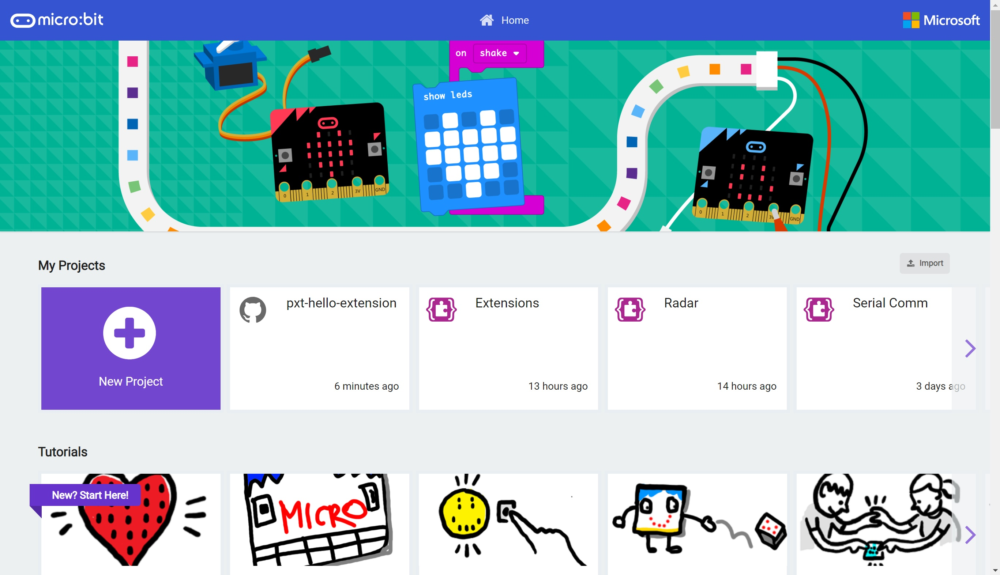
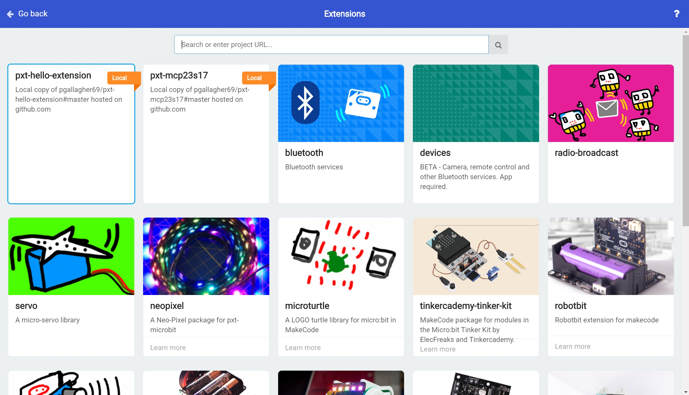
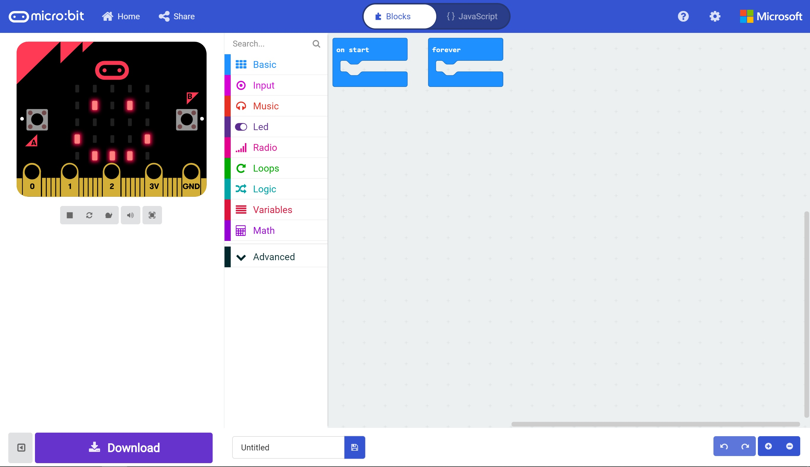

# Building an Extension #

Travis CI builds are triggerred automatically when we Commit our code to our GitHub Repo.

## Step 10 - Use our Extension ##

- Open up another browser tab and navigate to https://makecode.microbit.org. 
- You'll now see your new pxt-hello-extension in the project list;

    

- Create a New Project.
- Hit the Settings Cog and choose the Extensions Menu Item.
- You should now see your new extension available in the list of extensions (Wahoo!);

    

- Click the pxt-hello-extension to add it to our project.
- Although we don't see any new Toolbox Sections or blocks appearing, you will notice that our display has updated to show the smiley face that was scaffolded along with our extension;

    

- Any extension code written directly into the main.ts file will be executed when our Micro:Bit code first runs.

| Previous | Next |
| -------- | ---- |
| [< Step 9 - Commit and Build](9-commit-and-build.md) | [Step 11 - Adding a Block >](11-adding-block.md) |