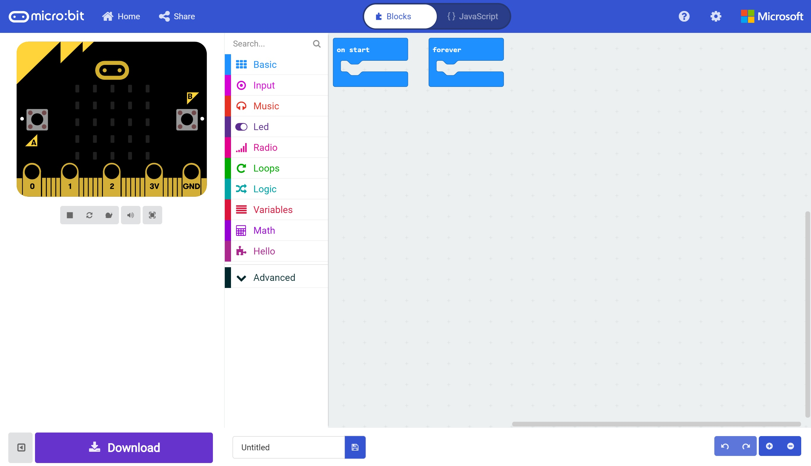
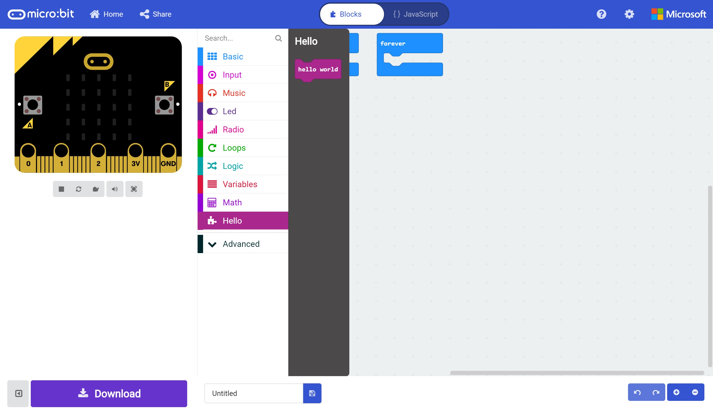
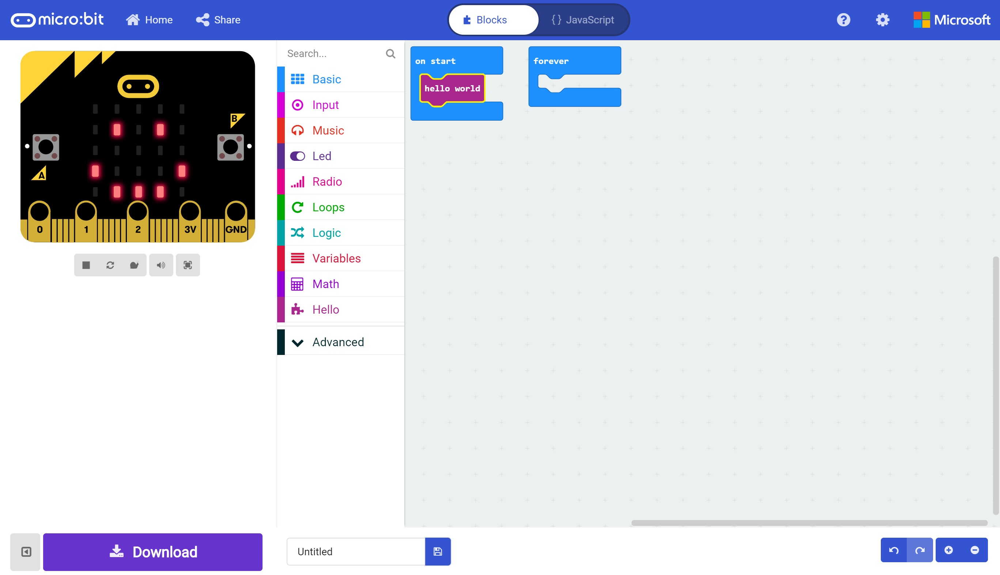

# Building an Extension #

Our extension, although functioning, doesn't give us anything to drag into a program as yet.

In this section we'll add some code and "Macros" to our extension to create a block for us to drag into our program.

## Step 11 - Adding a Block ##

- Switch back to your Extension Browser Tab. 
- Replace your existing code with the following code;

```
//% color="#AA278D"
namespace hello {

    //% block
    export function helloWorld() {

        basic.showLeds(`
            . . . . .
            . # . # .
            . . . . .
            # . . . #
            . # # # .
            `);

    }

} 
```

- If you now switch back to the editor to which you added the new extension, you should see a new "Hello" Toolbox Section Appear;

<p align="center">
    
</p>

- Clicking the new "Hello" Toolbox Section will show our new "Hello" extension blocks;

<p align="center">
    
</p>

- There will only be a single block in the Hello Toolbox Section named "Hello World";

<p align="center">
    
</p>

- Drag our new "Hello World" block onto the "On Start" block.
- You'll see that the Simulated Micro:Bit display will show our familiar smiley face;

<p align="center">
    
</p>

| Previous | Next |
| -------- | ---- |
| [< Step 9 - Commit and Build](9-commit-and-build.md) | [Step 11 - Adding a Block >](11-adding-block.md) |