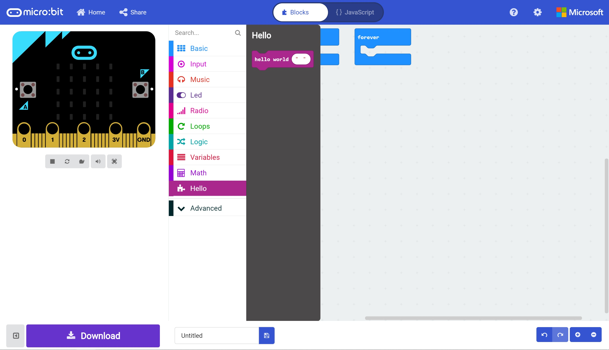
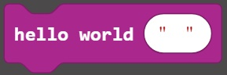
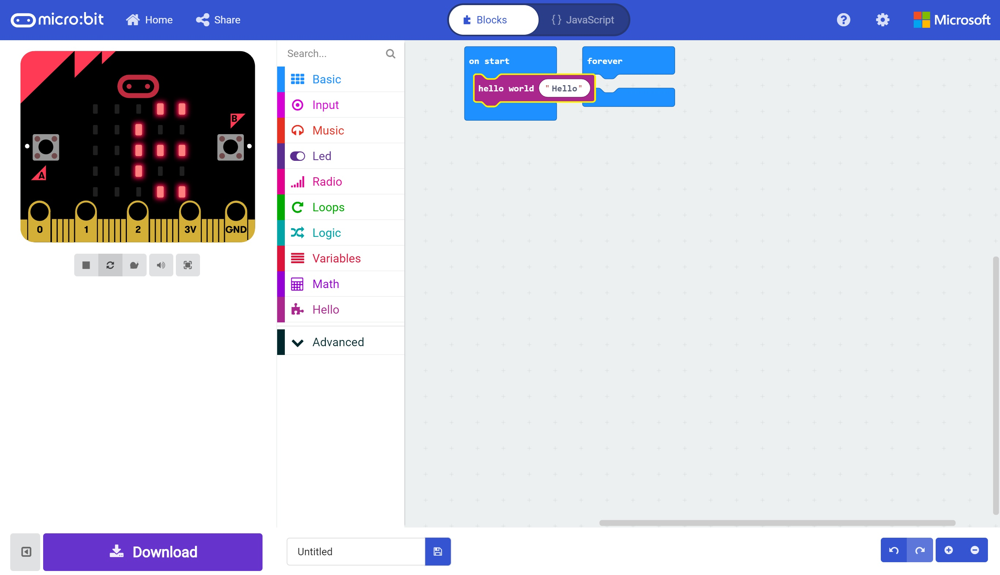
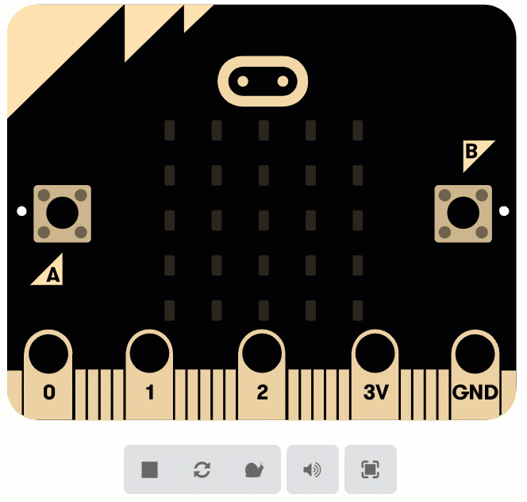
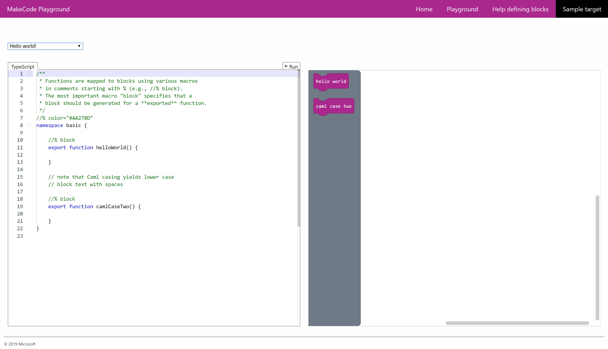

# Building an Extension #

Now we have a functioning block that we can drag into our Program.
However, this block simply performs an action with no intervention from our program.
In this section we'll modify our Extension Code to allow our Hello World Block to receive a Paramater which will change what our block does.

## Step 11 - Adding a Parameter ##

- In the Editor to which you've added your extension and the "HelloWorld" block, drag the "HelloWorld" block to the bin.
- Switch back to your Extension Browser Tab. 
- Replace your existing code with the following code;

```
//% color="#AA278D"
namespace hello {

    //% block
    export function helloWorld(s: string) {

        basic.showString(s);

    }

} 
```

- Here we've added a string parameter to our "HelloWorld" function, and we're using the Basic.showString function to show the value of the passed in string on the display.

- If you now switch back to the editor to which you added the new extension and expand the "Hello" section, you'll see that the "HelloWorld" block can now accept a parameter;

<p align="center">
    
</p>

<p align="center">
    
</p>

- Drag the new "HelloWorld" block onto the "Start" block and change the value to "Hello".

<p align="center">
    
</p>

- Once the Simulator Updates, you'll see your text scroll across the screen as expected.

<p align="center">
    
</p>

- There are a heap more things that we can accomplish with extensions. You can begin by looking at the official documentation here;

https://makecode.com/extensions/getting-started

- Another fantastic resource is the MakeCode playground, where you can view a lot of sample extension setups, and play with the results live;

<p align="center">
    
</p>

- The URL for the MakeCode playground is https://makecode.com/playground

| Previous | Next |
| -------- | ---- |
| [< Step 11 - Adding the Block](11-adding-block.md) | [Introduction >](/README.md) |