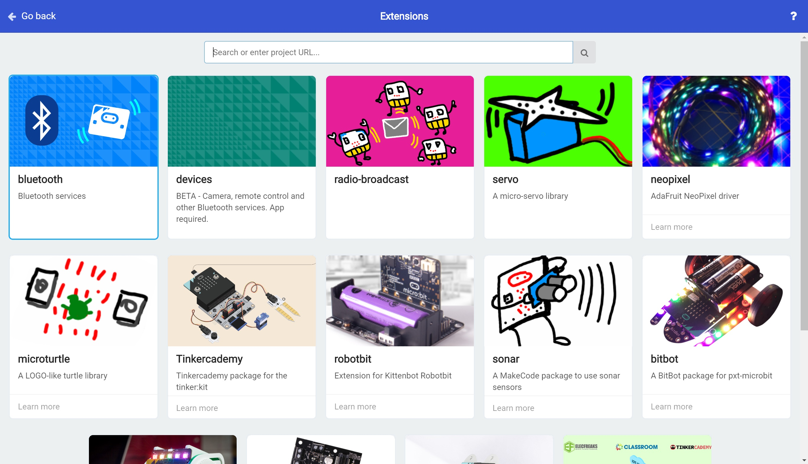
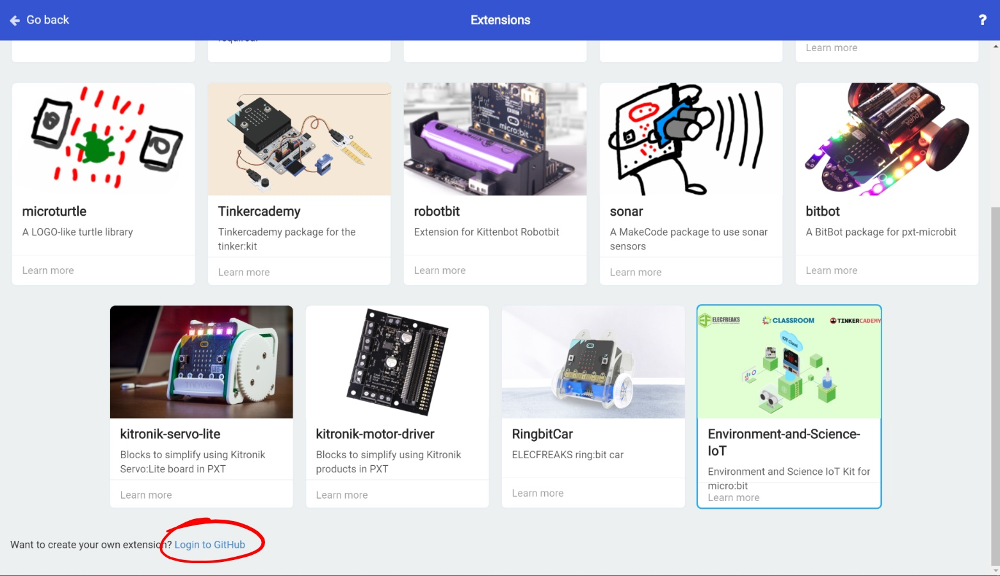
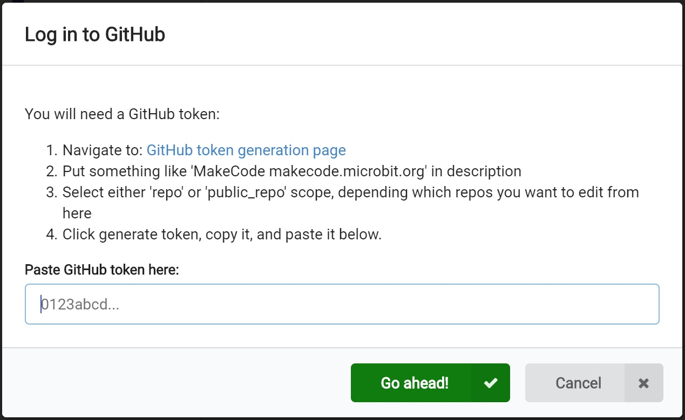

# Building an Extension #

## Step 4 - Extensions ##

- Click the Settings cog and select "Extensions".
- The Extensions list will be shown;

    

- Scroll to the bottom of the lsit and you'll see a line "Want to create your own extension? Login to GitHub";

    

- Click the "Login to GitHub" link to show the "Login to GitHub" window;

    

| Previous | Next |
| -------- | ---- |
| [< Step 3 - The MakeCode Editor](3-makecode-editor.md) | [Step 5 - GitHub Setup >](5-github-setup.md) |