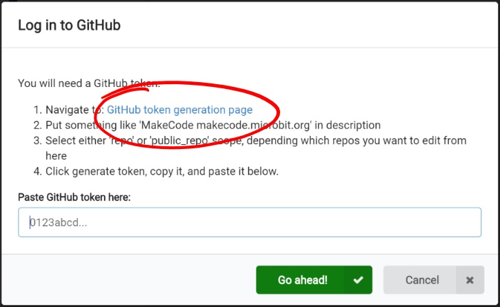

# Building an Extension #

## Step 5 - GitHub Setup ##

- Now hit the "GutGub token generation page" link.

    

- You'll be taken to GitHub... At this stage you can either just go ahead and log in if you have an account, or press the "Create an Account" link to go through and create a new Github account;

    

- Once you've logged in or created your new account, you'll be taken to the "New personal access token screen;

    

- Give your token a name "MakeCode makecode.microbit.org", and click the "public_repo" checkbox under the "repo" category. This will allow us to interact with our repo;

    

- Scroll to the bottom of the page and hit the green "Generate Token" button to generate your token;

    

- You'll now be taken to a page with all of your current Personal Access Tokens.
- Your new token will be shown in green at the top of the list;

    

- Press the small Copy icon to the right of your new personal access token to copy it to your clipboard;

    

- Return to MakeCode, paste in your new Personal Access Token and press the green "Go ahead!" button.
- You'll be returned to the MakeCode editor, and a message saying "Token Stored, checkout Import on home screen now!" will be shown;

    

- Press the Home Button to return to the Home Page.

| Previous | Next |
| -------- | ---- |
| [< Step 4 - Extensions](4-extensions.md) | [Step 6 - Import Github >](6-github-import.md) |