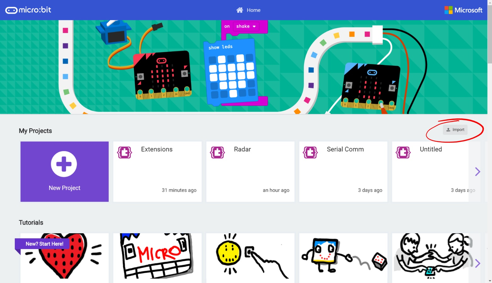
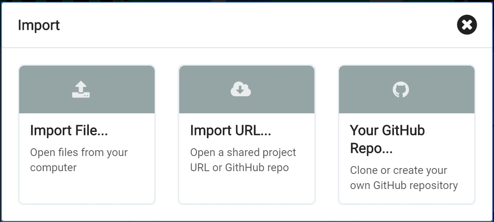
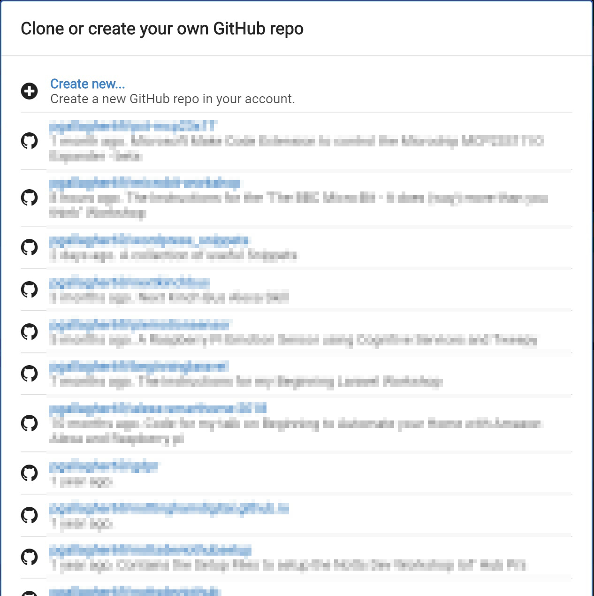
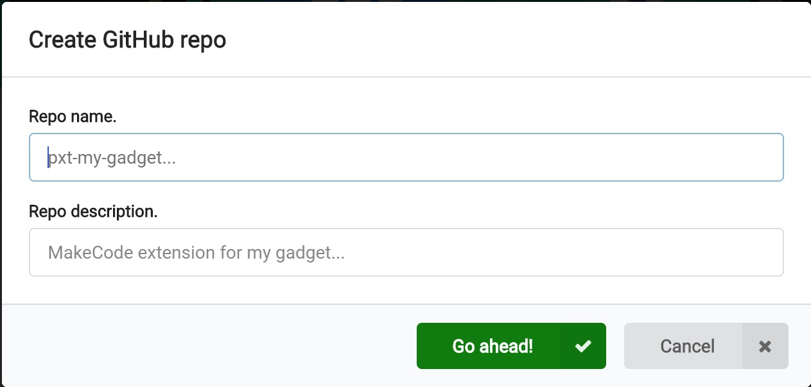
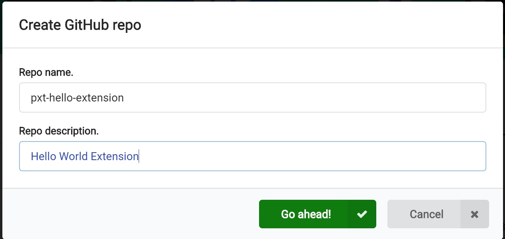

# Building an Extension #

## Step 6 - GitHub Import ##

- On the main MakeCode homepage, there's an Import Button;

    

- Hit the "Import" button to show the "Import" window;

    

- Press the "Your GitHub Repo..." option to show the Clone or Create Your Own GitHub repo window;

    

- Click the "Create new..." link at the top of the list of items to show the "Create GitHub Repo" window;

    

- Enter a name for your repo... For MakeCode Extensions, it's important to prefeix your repo with "pxt-", so let's call our repo "pxt-hello-extension".
- Enter a description of some sort so you know what your extension is;

    

- Hit the green "Go ahead!" button to create your repo.

| Previous | Next |
| -------- | ---- |
| [< Step 5 - GitHub Setup](5-github-setup.md) | [Step 7 - Creating the Extension >](7-creating-extension.md) |