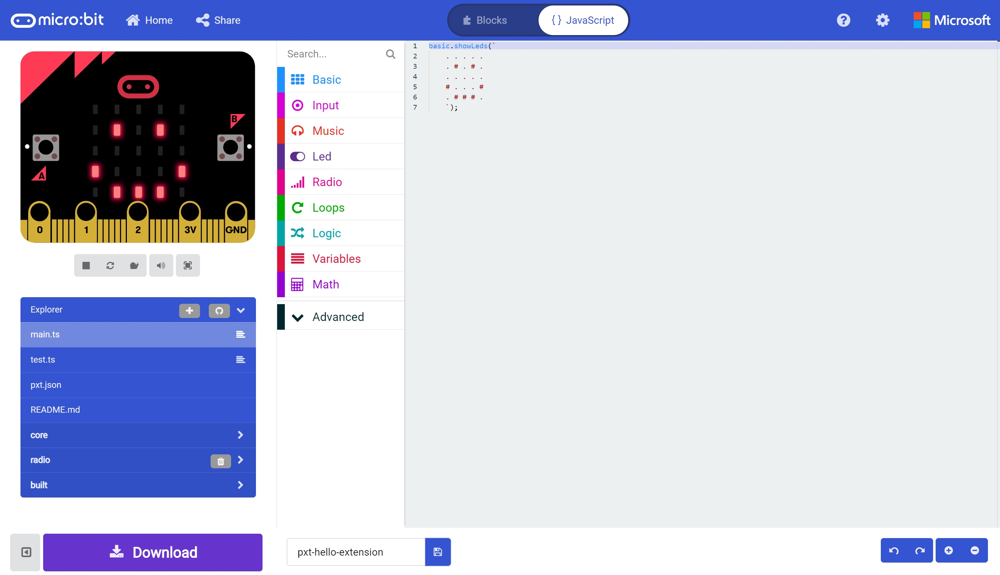
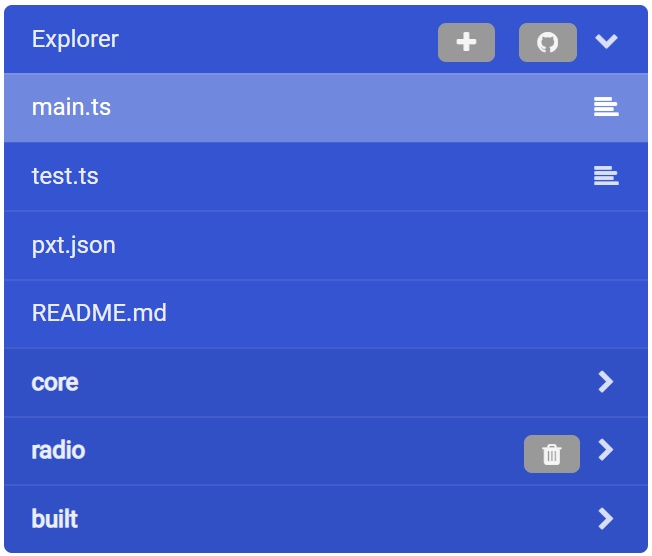
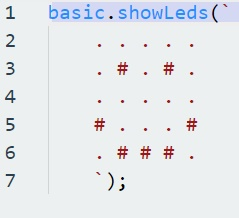

# Building an Extension #

## Step 7 - Creating the Extension ##

- You'll be taken to the MakeCode Editor;

    

- You'll now see various files listed below the simulator. These are the source files of our new Extension;

    

- The main file we're interested in right now is the "main.ts" file. This will house the main source code of our new extension.
- Currently we've been given some really simple code in our "main.ts" file which just displays an icon;

    

- You'll notice that the extension for our files is ".ts", this denotes a "TypeScript" file, which is a Type Safe version of Javascript.

| Previous | Next |
| -------- | ---- |
| [< Step 6 - GitHub Import](6-github-import.md) | [Step 8 - Automated Build >](8-automated-build.md) |