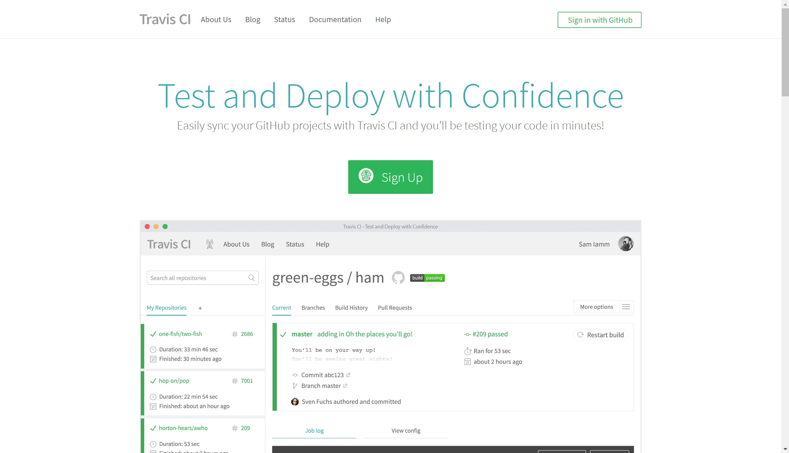
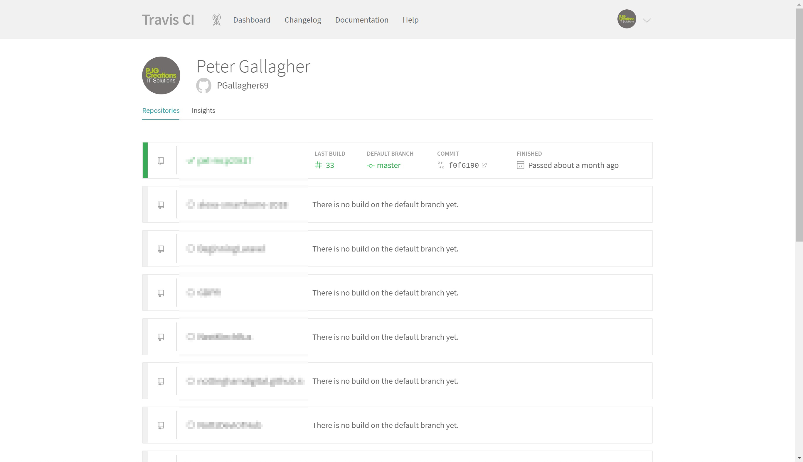
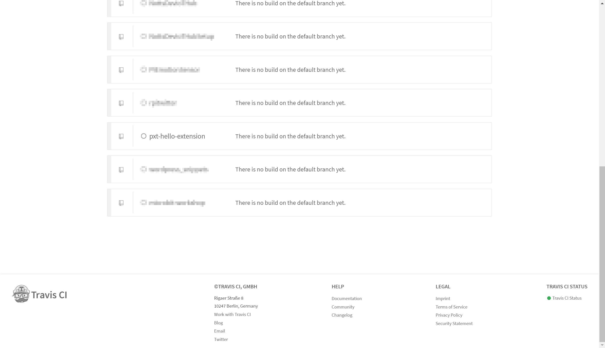
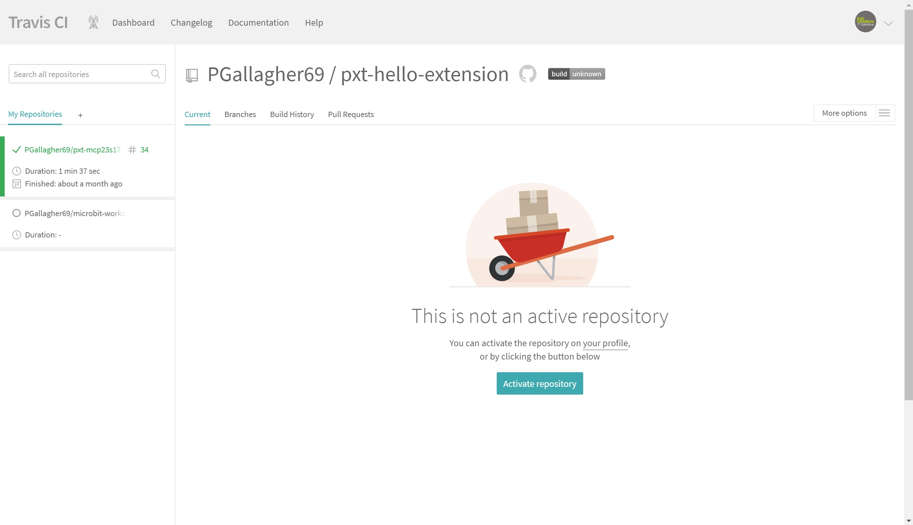
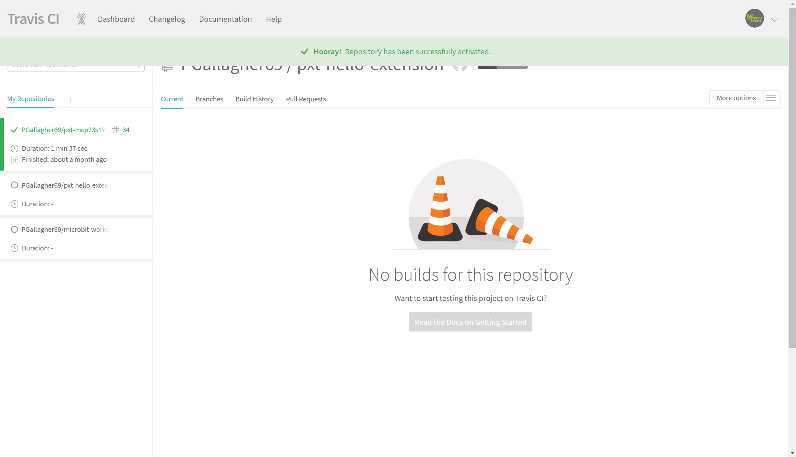

# Building an Extension #

MakeCode Extensions are compiled into a binary file which is then included in a project.

This compilation or build is carried out using a system called Travis CI, which is a Continuous Integration platform..

## Step 8 - Automated Build ##

- If we click the "README.md" we'll see our next steps;

    

- We're not going to worry too much about anything other than the 4th step - "Turn on your automated build on https://travis-ci.org".
- Go ahead and navigate to https://travis-ci.org;

    

- You should already have a GitHub account, so click the "Sign in with GitHub" button in the top right;

    

- Once you've signed in. you should see a list of your available GitHub repositories;

    

- Find your new "pxt-hello-extension" Repository (Or whatever you called it!);

    

- Clicking the repo name will take you to the repo page;

    

- Clicking the "Activate repository" button to enable the Travis CI build for your repository.

    

| Previous | Next |
| -------- | ---- |
| [< Step 7 - Creating the Extension](7-creating-extension.md) | [Step 9 - Commit Code and Build >](9-commit-and-build.md) |