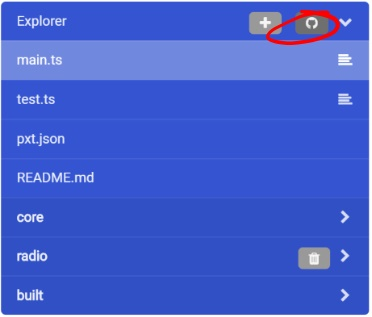
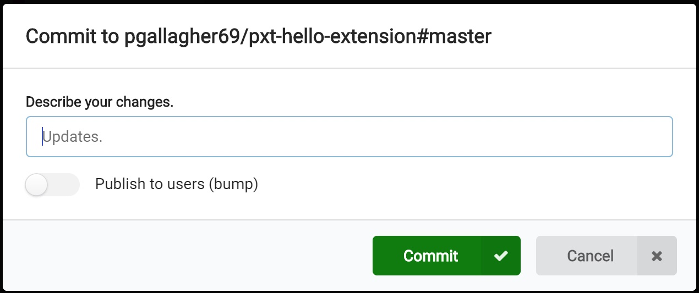
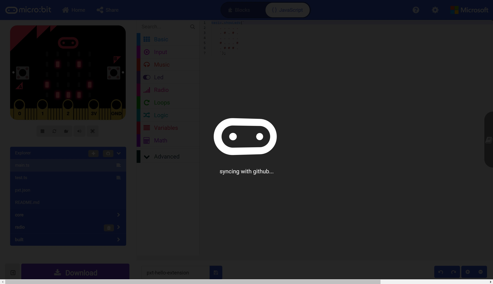
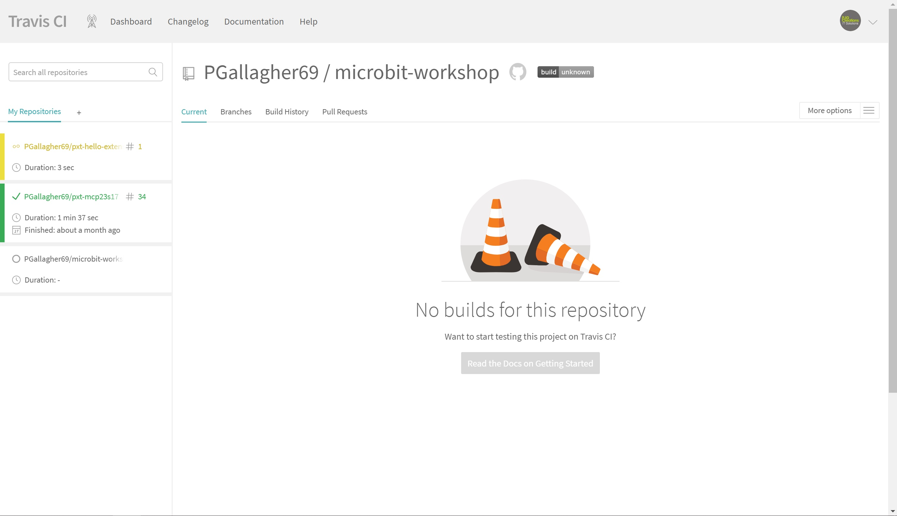
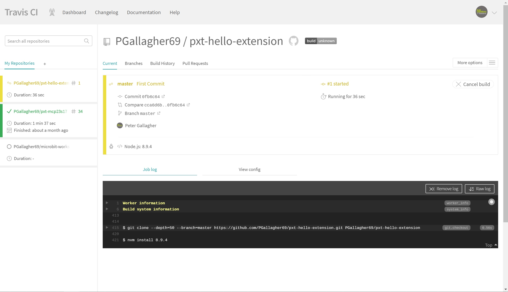
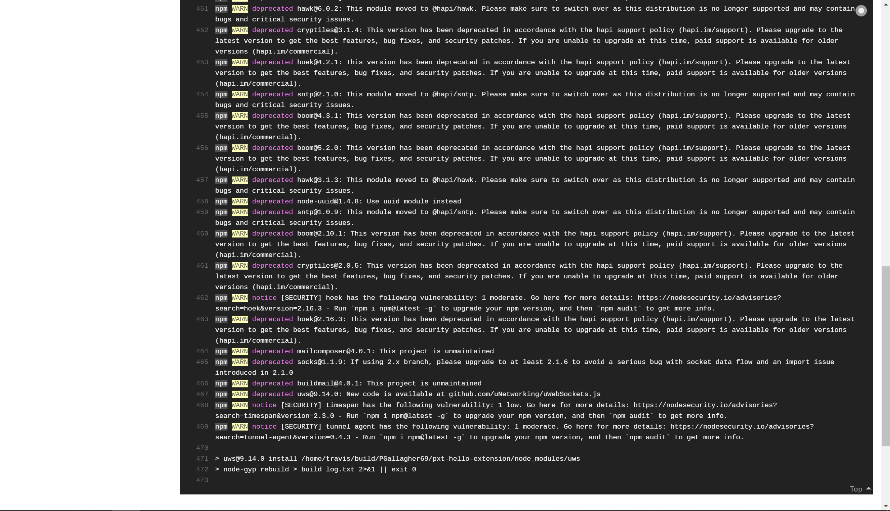
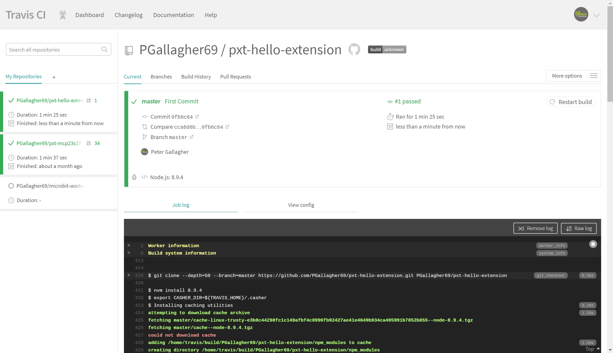
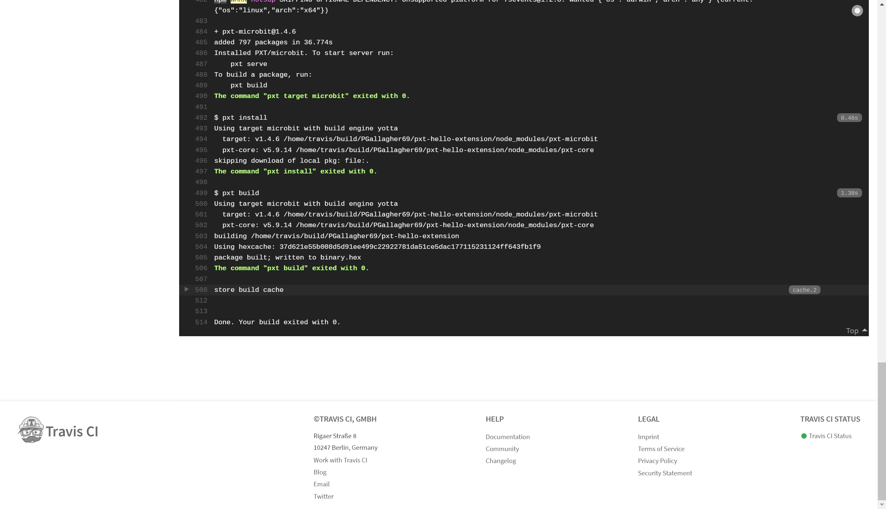

# Building an Extension #

Travis CI builds are triggerred automatically when we Commit our code to our GitHub Repo.

## Step 9 - Commit and Build ##

- Return to the MakeCode editor. 
- At the top right of our file list below the simulator is a small GitHub Icon. This is the "Sync with GitHub" button;

    

- The "Sync with GitHub" button will push our code to our GitHub Repo and trigger a Travis CI Build.
- Hit the "Sync with GitHub button to show the Commit window;

    

- Fill in a description of the changes. As this is the first time we've committed our changes, then we can write something like "First Commit".
- Leave the "Publish to users (bump) radio button off for now.
- Once you're happy with your description, go ahead and press the green "Commit" button;

    

- Switching back to the Travis CI window, we can monitor the progress of our automated build.
- The first thing we'll notice is that the font colour of repository on the left will turn to yellow;

    

- You can now click on the name of our repository to see the status of the build operation;

    

- You'll see the Black Status Box at the bottom will begin to show the status updates of the build progress;

    

- After a little while (and assuming everything is ok with our code!), the build will complete;

    

- If you scroll down to the bottom of the page, you can also have a look at the output of the build too, which should say "Done. Your build exited with 0."

    

| Previous | Next |
| -------- | ---- |
| [< Step 8 - Automated Build](8-automated-build.md) | [Step 10 - Using our Extension >](10-using-extension.md) |