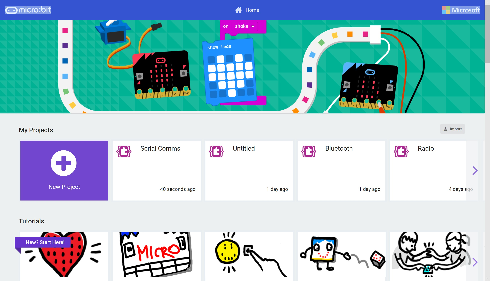

# Creating a simple MakeCode Extension #

In this section we're going to going to create our own MakeCode Extension. This will allow us to build more complex functionality together into simple to use blocks.

This allows developers to make complex operations available to all users.

All of the extensions you see when you press the Extensions Toolbox Sections will have been built this way. Infact, the code is readily available for us to look at in order to see how MakeCode extensions are built.

All MakeCode extensions live in GitHub, so for this example you'll need to go and grab yourself a GitHub.com account. But first, we'll go back to MakeCode and start authoring our extension.

----

## Step 1 - Return to MakeCode ##

- Goto [MakeCode](https://makecode.microbit.org)

    

- You'll notice your "Sonar" (or whatever you called it!) project is now visible.

| Previous | Next |
| -------- | ---- |
| [< Introduction](/README.md) | [Step 2 - New Project >](2-new-project.md) |
