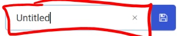
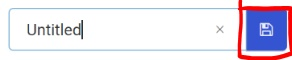
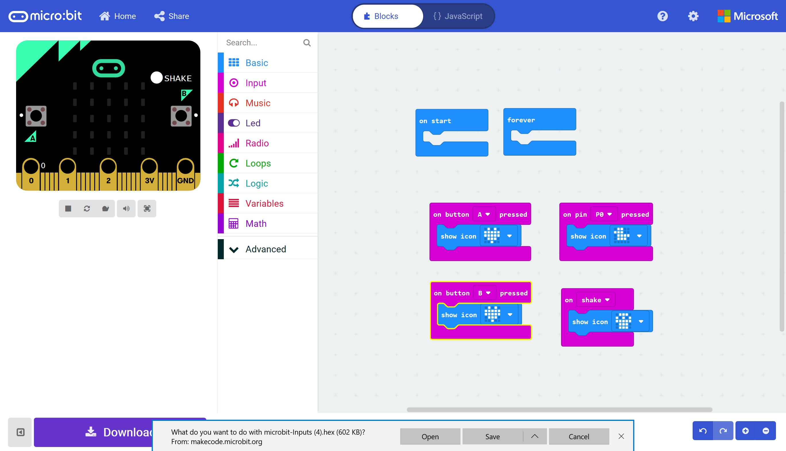

# Hello (Micro:Bit) World! #

## Step 10 - Save the Project ##

- Enter a Name in the FileName Box" (currently shown as Untitled).

    

- Hit the Save Icon.

    

- Save the file to a location on your machine.

    

| Previous | Next |
| -------- | ---- |
| [< Step 9 - Test the Program](9-test-the-program.md) | [ Introduction >](/README.md) |