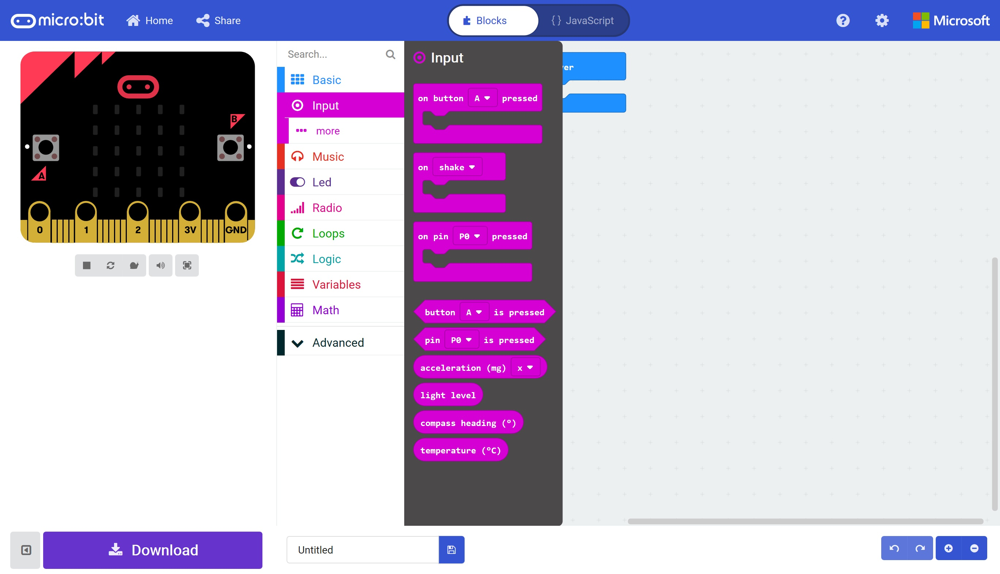

# Buttons and I/O #

## Step 4 - The Input Toolbox ##

Click the "Input" section in the toolbox

    

| Previous | Next |
| -------- | ---- |
| [< Step 3 - MakeCode Editor](3-makecode-editor.md) | [Step 5 - Button A Pressed >](5-button-a-pressed.md) |