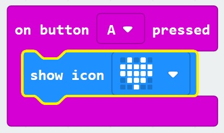

# Buttons and I/O #

## Step 5 - Button A Pressed ##

- Drag the "On Button A Pressed" block onto the designer;

    

- Expand the "Basic" Toolbox Section
- Drag a "Show Icon" Block onto the "On Button A Pressed" Block

    

| Previous | Next |
| -------- | ---- |
| [< Step 4 - Input Toolbox](4-input-toolbox.md) | [Step 6 - Button B Pressed >](6-button-b-pressed.md) |