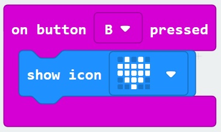

# Buttons and I/O #

## Step 6 - Button B Pressed ##

- Expand the "Input" Toolbox Section again.
- Drag another "On Button A Pressed" block onto the designer;

    

- Press the "A" section of the Block and select "B"

    

- Expand the "Basic" Toolbox Section again.
- Drag another "Show Icon" Block onto the "On Button B Pressed" Block

    

- Press the "Heart" icon image and select another image.

    

| Previous | Next |
| -------- | ---- |
| [< Step 5 - Button A Pressed](5-button-a-pressed.md) | [Step 7 - On Shake >](7-on-shake.md) |