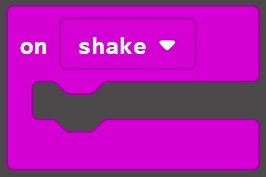
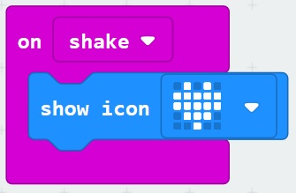
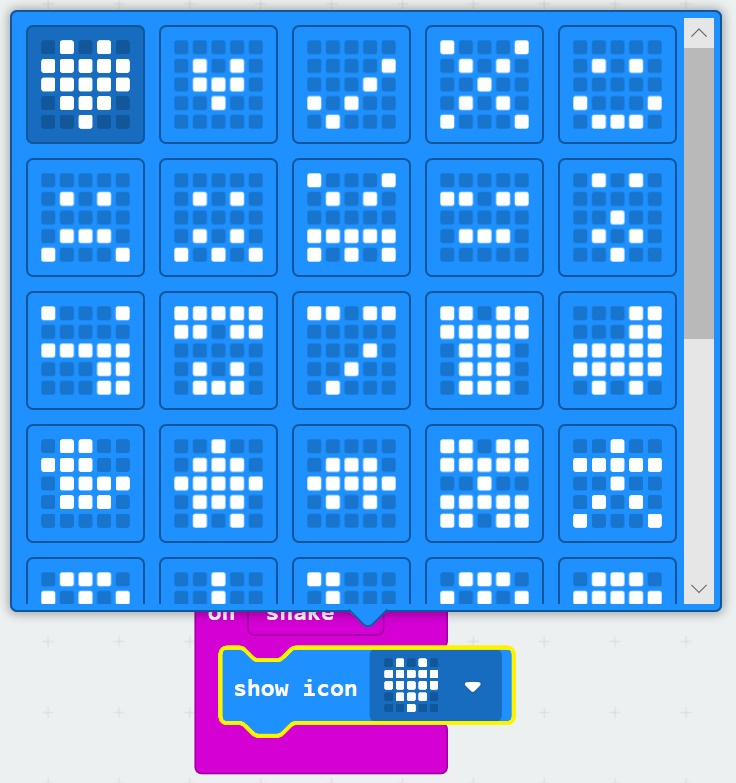

# Buttons and I/O #

## Step 7 - On Shake ##

- Expand the "Input" Toolbox Section again. 
- Drag the "On Shake" block onto the designer;

    

- Expand the "Basic" Toolbox Section
- Drag a "Show Icon" Block onto the "On Shake" Block

    

- Press the "Heart" icon image and select another image.

    

| Previous | Next |
| -------- | ---- |
| [< Step 6 - Button B Pressed](6-button-b-pressed.md) | [Step 8 - Pin 0 Pressed >](8-pin-0-pressed.md) |