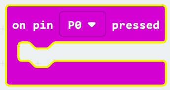
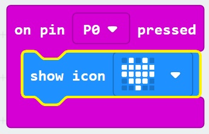
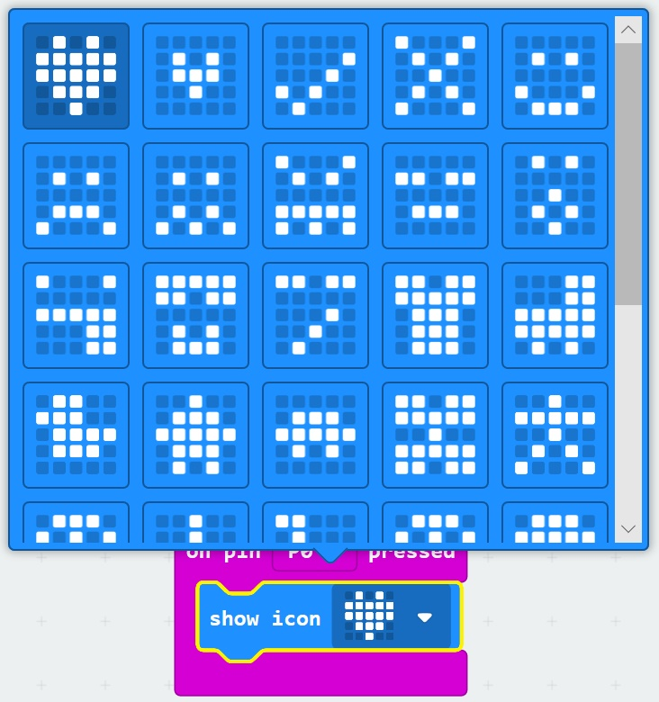

# Buttons and I/O #

## Step 8 - Pin 0 Pressed ##

- Expand the "Input" Toolbox Section again. 
- Drag the "On Pin P0" block onto the designer;

    

- Expand the "Basic" Toolbox Section
- Drag a "Show Icon" Block onto the "On Pin P0 Pressed" Block

    

- Press the "Heart" icon image and select another image.

    

| Previous | Next |
| -------- | ---- |
| [< Step 7 - On Shake](7-on-shake.md) | [Step 9 - Test the Program >](9-test-the-program.md) |