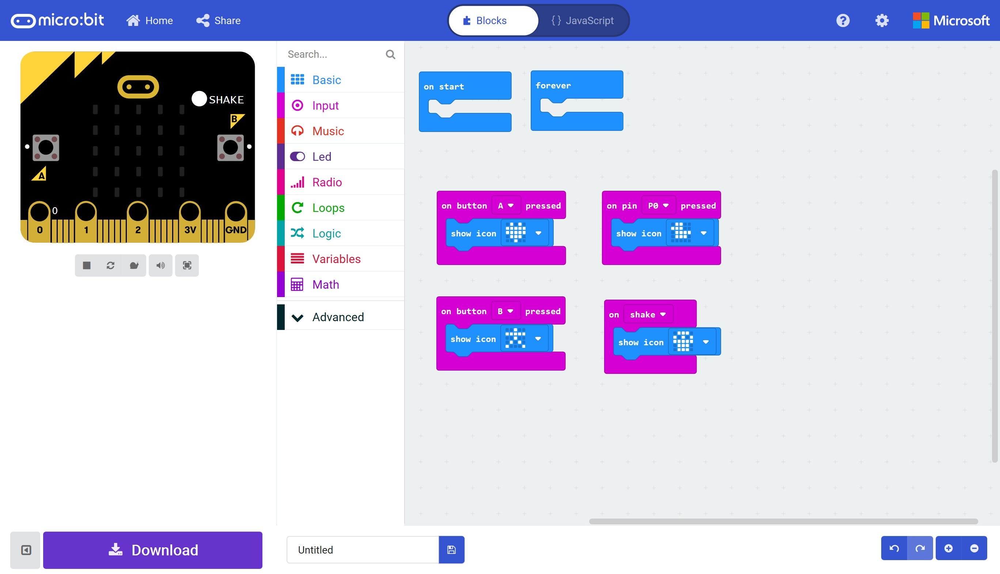
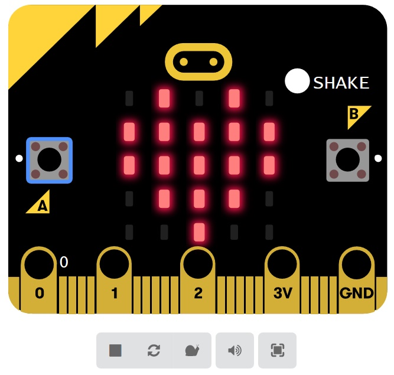
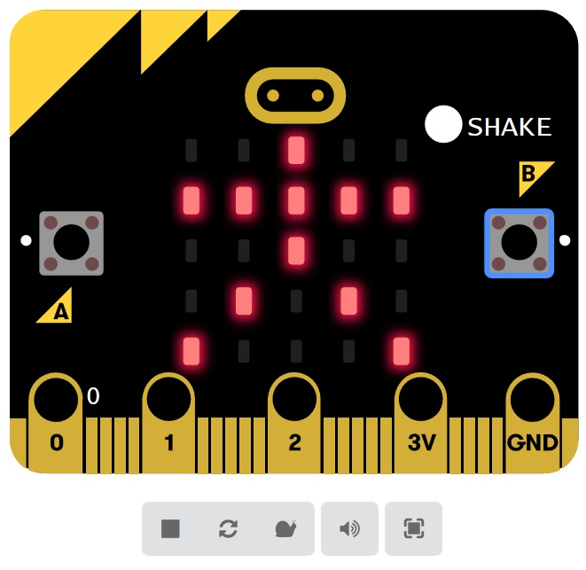
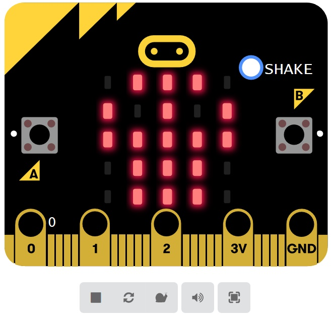
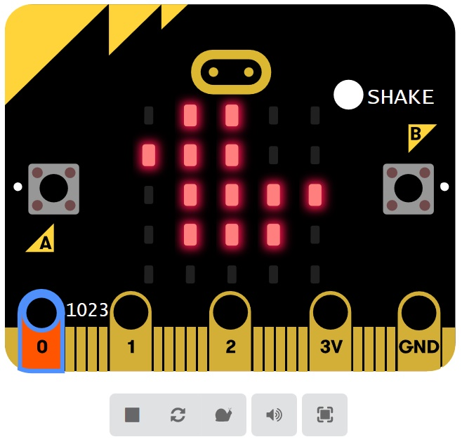

# Buttons and I/O #

## Step 9 - Test the Program ##

- Your finished program should look something like the following;

    

- Press the "A" button in the simulated Micro:Bit on the Left, the display should show a heart;

    

- Press the "B" button in the simulated Micro:Bit on the Left, the display should show the icon you choose earlier;

    

- Press the "Shake" button in the simulated Micro:Bit on the Left, the display should show the icon you choose earlier;

    

- Press the "0" pin at the bottom of the simulated Micro:Bit on the Left, the display should show the icon you choose earlier;

    

| Previous | Next |
| -------- | ---- |
| [< Step 8 - Pin 0 Pressed](8-pin-0-pressed.md) | [ Step 10 - Save Project >](10-save-project.md) |