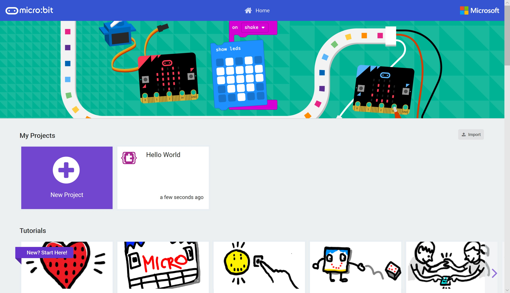

# Buttons and I/O #

## Step 1 - Return to MakeCode ##

- Goto [MakeCode](https://makecode.microbit.org)

    

- You'll notice your "Hello World" (or whatever you called it!) project is now visible.

| Previous | Next |
| -------- | ---- |
| [< Introduction](/README.md) | [Step 2 - New Project >](2-new-project.md) |
