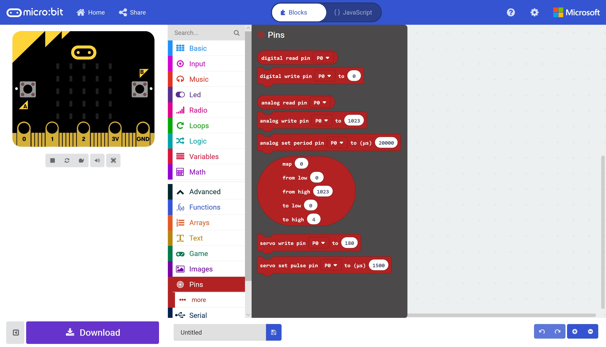
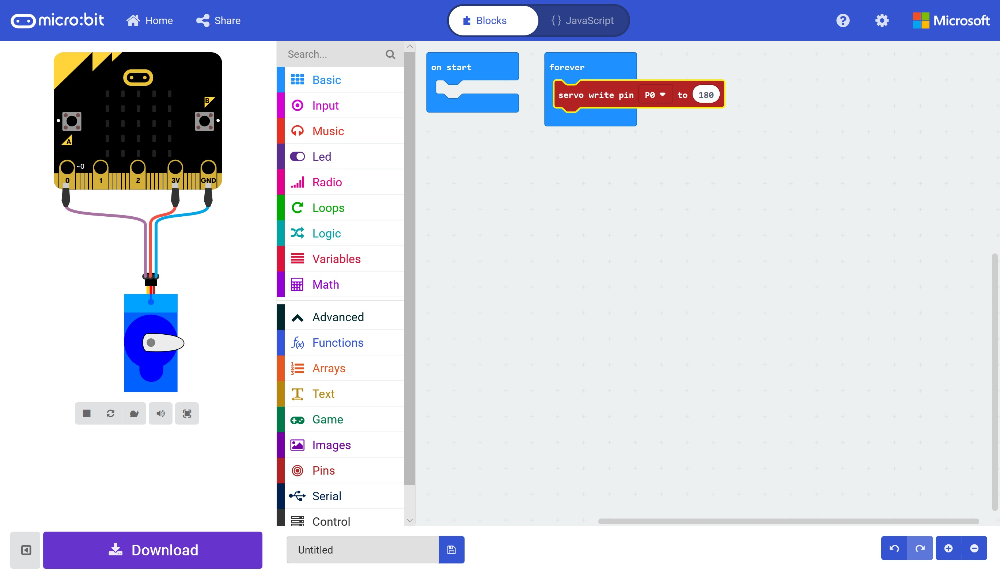

# Controlling Hardware #

## Step 4 - Add a Servo ##

- Click the Advanced Toolbox Section to reveal the Advanced Toolbox Sections.
- Click the Pins Toolbox Section;

    

- Drag a "Servo Write Pin (P)) to (180)" Block onto the "Forever" Block;

    

- You'll see that our simulator now has a Micro-Servo connected to our Micro:Bit;

    

| Previous | Next |
| -------- | ---- |
| [< Step 3 - MakeCode Editor](3-makecode-editor.md) | [Step 5 - Move the Servo >](4-move-servo.md) |