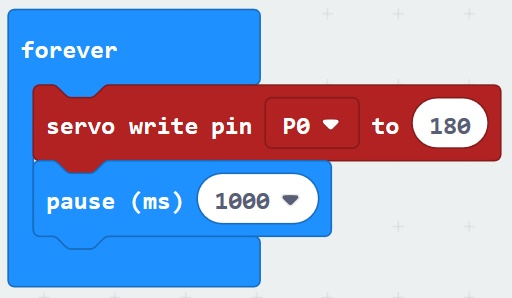
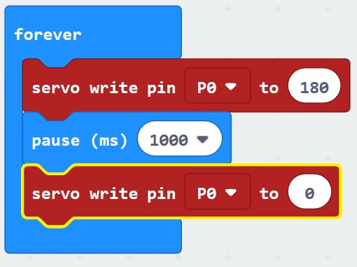
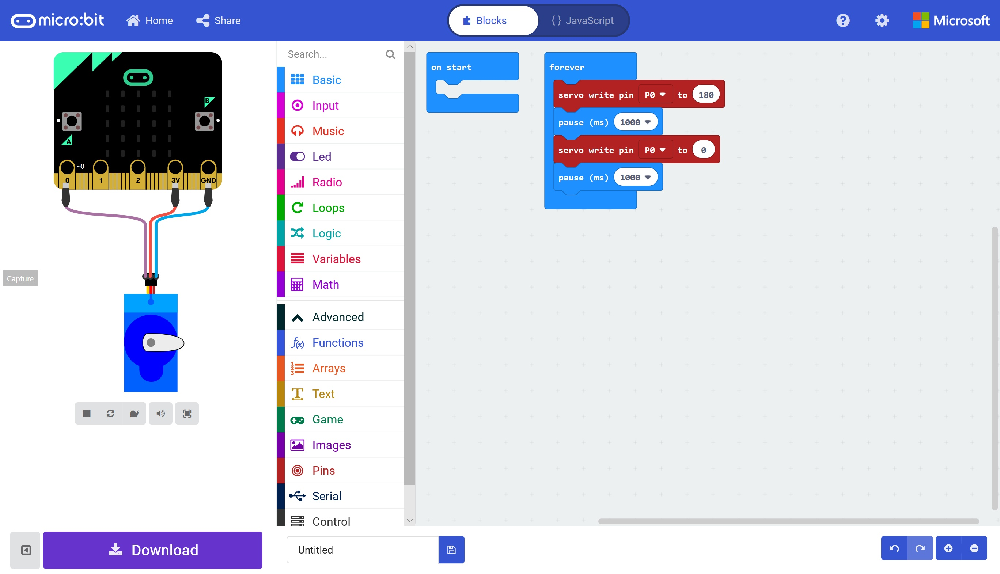
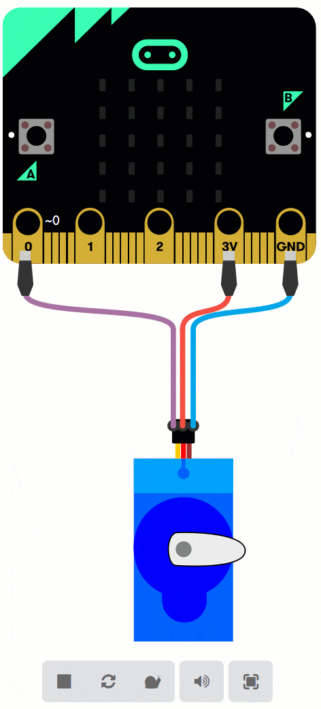

# Controlling Hardware #

## Step 5 - Move the Servo ##

- From the Basic Toolbox, drag a "Pause (100)" below the "Servo Write Pin" block and change the Pause Time to "1 Second";

    

- Click the Advanced Toolbox Section again to reveal the Advanced Toolbox Sections.
- Click the Pins Toolbox Section again, drag another "Servo Write Pin" block beneath the "Pause" block and change the angle to 0;

    

- Finally, drag another "Pause" block below our second "Servo Write Pin" block and again change the time to "1 Second.
- You should now have a program similair to below;

    

- You should see that the Simulated servo is moving from right to left and back again once a second;

    

- Go ahead and give your project a name and save the HEX file to a location on your machine.
- Program your Micro:Bit with your code, and you will be able to give a real Servo a go...

- You can download an example HEX file here;

<a href="hex/microbit-Servo-Move.hex">Move Servo</a>

| Previous | Next |
| -------- | ---- |
| [< Step 4 - Add a Servo](4-add-servo.md) | [Step 6 - Sonar Extension >](6-sonar-extension.md) |