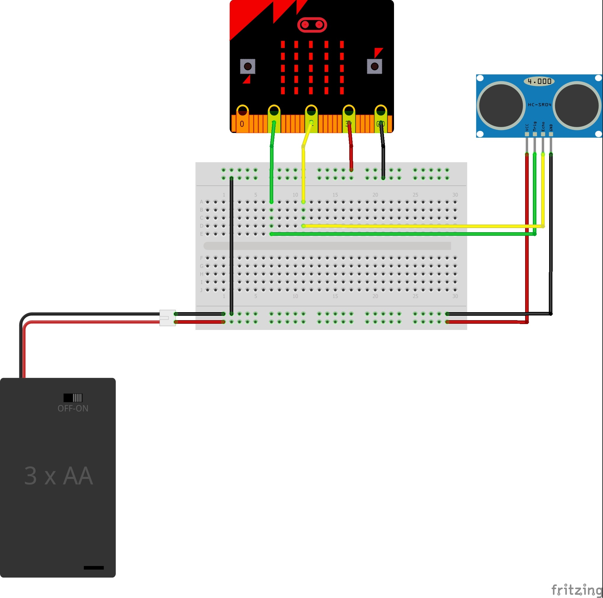

# Controlling Hardware #

In this section we're going to control and read a Sonar Device.

There's no way of simulating sonar in MakeCode... So to make this one work, you'll need an actual device.

We'll be using the HC-SR04 UltraSonic Distance Sensor;

    

You can connect the device up using the following circuit;

    

You'll see that we've connected an extra Battery into the circuit here, as the HC-SR04 requires around 5v to operate, and our Micro:Bit only outputs 3v, which isn't going to cut it. SO we've added 3 AA batteries, which gives us around 4.5v. 

## Step 6 -Add the Sonar Extension ##

- Click the Advanced Toolbox Section;
- Click the Extensions Toolbox Item at the bottom of the Advanced List;

    

- This will show the list of available extensions for the Micro:Bit and MakeCode.
- Select the "Sonar" extension;

    

- You can find out more information about this extension here;

https://makecode.microbit.org/pkg/microsoft/pxt-sonar

- You'll be returned to the editor, and a new Sonar Toolbox Section will be shown;

    

| Previous | Next |
| -------- | ---- |
| [< Step 5 - Move the Servo](5-move-servo.md) | [Step 7 - Sonar Toolbox >](7-sonar-toolbox.md) |