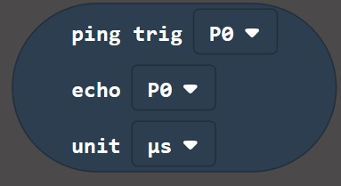

# Controlling Hardware #

## Step 7 - The Sonar Toolbox ##

- Drag a "Show Number (0)" Block from the Basic Toolbox Section onto the "Forever" Block.
- Click the new Sonar Toolbox Section;

    

- This will show the (rather limited) Sonar Blocks available in the Sonar Extension, consisting of a single "Ping" Block;

    

- Drag the "Ping" Sonar Block onto the "0" of the "Show Number" Block;

    

- Change the "Trig" item from "P0" to "P1".
- Change the "Echo" item from "P0" to "P2".
- Change the "Unit" item from "μs" to "Inches"; 

    

- The Display on the Simulator will begin to scroll 33, which is the maximum reading of the HC-SR04 device in inches.
- Again, the simulator can't help us with the HC-SR04 device, for us to see it working, we'll need to build a Physical Circuit.
- Go ahead and give your project a name and save the HEX file to a location on your machine.
- Program your Micro:Bit with your code, and you will be able to give the HC-SR04 a go...

| Previous | Next |
| -------- | ---- |
| [< Step 6 - Sonar Extension](6-sonar-extension.md) | [Step 7 - Sonar Toolbox >](7-sonar-toolbox.md) |