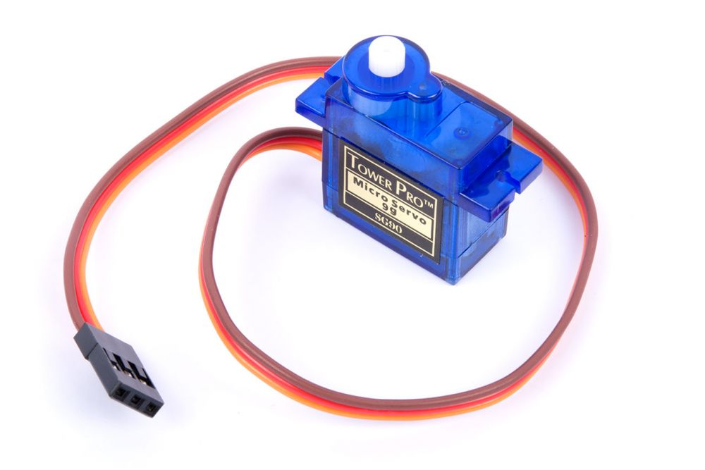
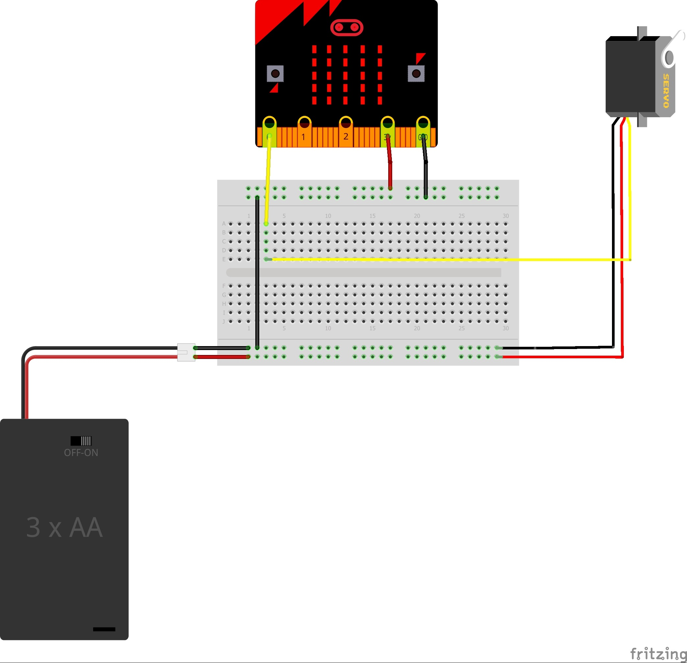
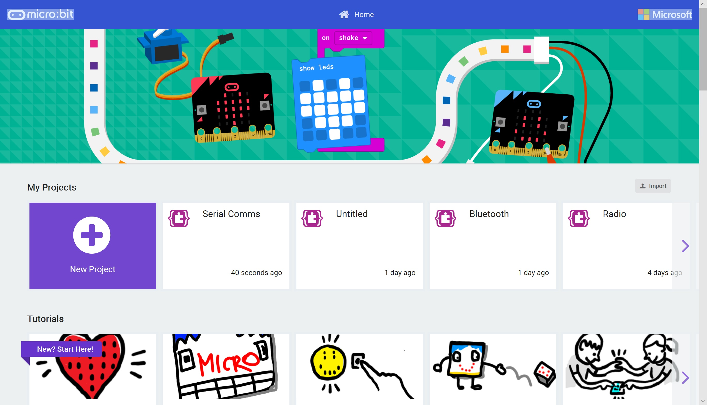

# Controlling Hardware #

In this section we're going to be connecting our Micro:Bit to our some external components.

We'll begin by hooking up a Micro-Servo.

A Micro-Servo is a device which, when controller by our Micro:Bit, allows the Micro:Bit to rotate something axially;

    

The MakeCode Editor will allow us to Simulate a Servo.

If however, you want to use a Physical Micro:Bit and Servo you'll need to power it using a Battery Pack, as the Micro:Bit can't power a Physical Servo Directly...

You can use this circuit;

    

----

## Step 1 - Return to MakeCode ##

- Goto [MakeCode](https://makecode.microbit.org)

    

- You'll notice your "Serial Comms" (or whatever you called it!) project is now visible.

| Previous | Next |
| -------- | ---- |
| [< Introduction](/README.md) | [Step 2 - New Project >](2-new-project.md) |
