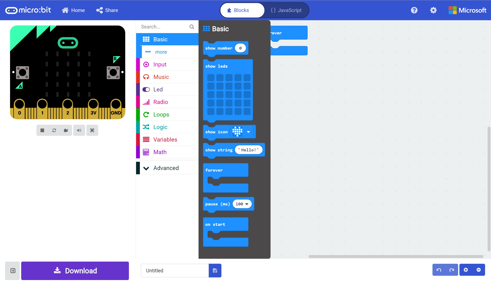

# Hello (Micro:Bit) World! #

## Step 4 - The Basic Toolbox ##

Click the "Basic" section in the toolbox

    

| Previous | Next |
| -------- | ---- |
| [< Step 3 - MakeCode Editor](3-makecode-editor.md) | [Step 5 - View the Result >](5-view-result.md) |