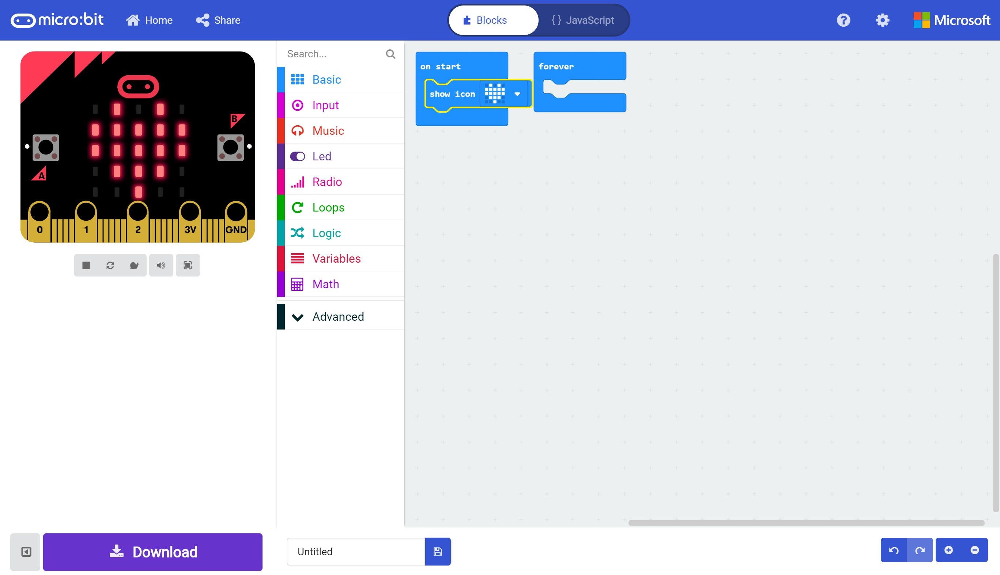

# Hello (Micro:Bit) World! #

## Step 5 - View the Result ##

- Drag a "Show Icon" Block onto the "On Start" block.
- Wait for the Micro:Bit Simulator to update and show the result.

    

| Previous | Next |
| -------- | ---- |
| [< Step 4 - Basic Toolbox](4-basic-toolbox.md) | [ Introduction >](/README.md) |