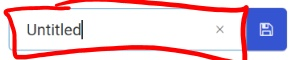
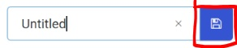
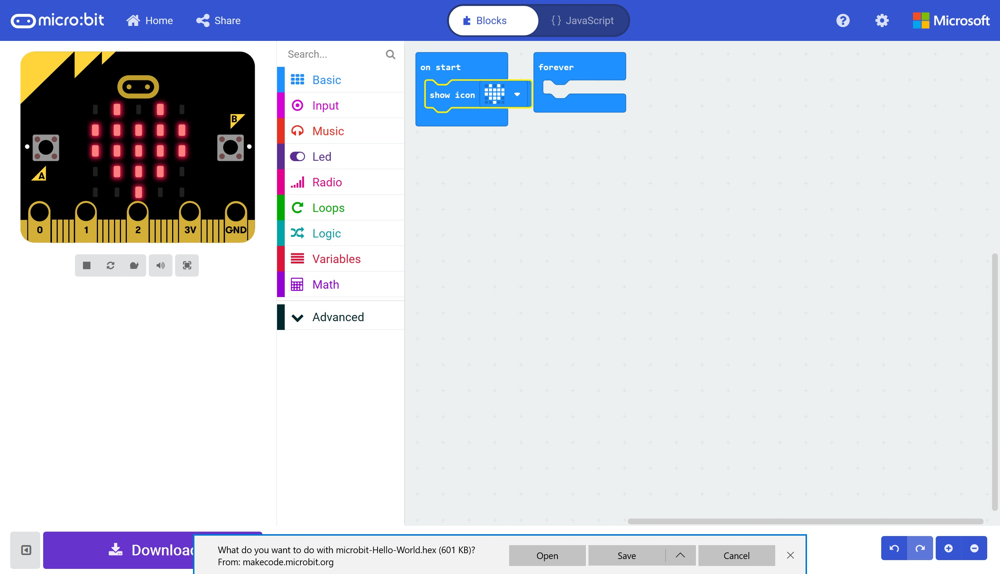

# Hello (Micro:Bit) World! #

## Step 5 - Save the Project ##

- Enter a Name in the FileName Box" (currently shown as Untitled).

    

- Hit the Save Icon.

    

- Save the file to a location on your machine.

    

- You can download an example HEX file here;

<a href="hex/microbit-Hello-World.hex">Hello World</a>

| Previous | Next |
| -------- | ---- |
| [< Step 5 - View Result](5-view-result.md) | [ Introduction >](/README.md) |