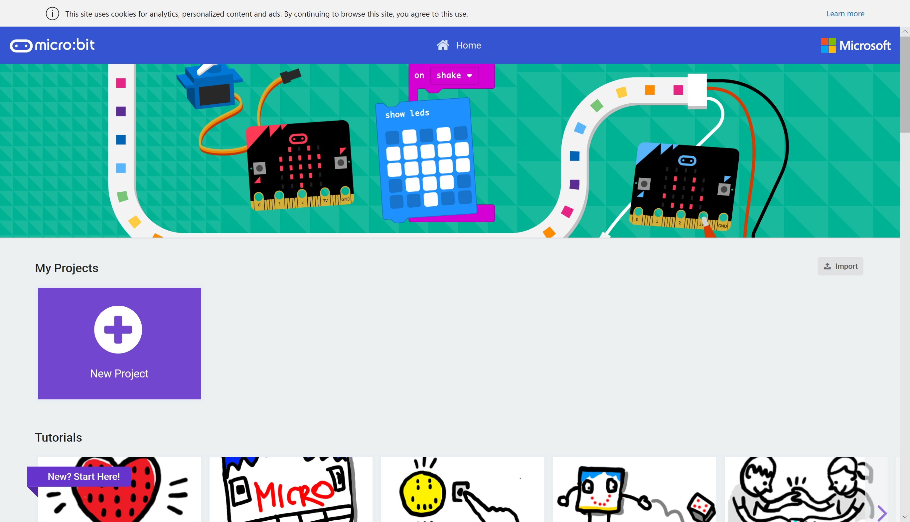

# Hello (Micro:Bit) World! #

## Step 1 - Open MakeCode ##

Goto [MakeCode](https://makecode.microbit.org)

    

| Previous | Next |
| -------- | ---- |
| [< Introduction](/README.md) | [Step 2 - MakeCode Editor >](2-new-project.md) |
