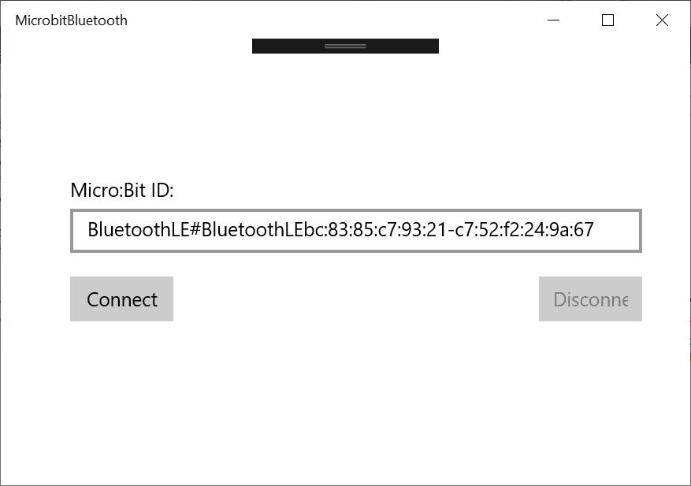
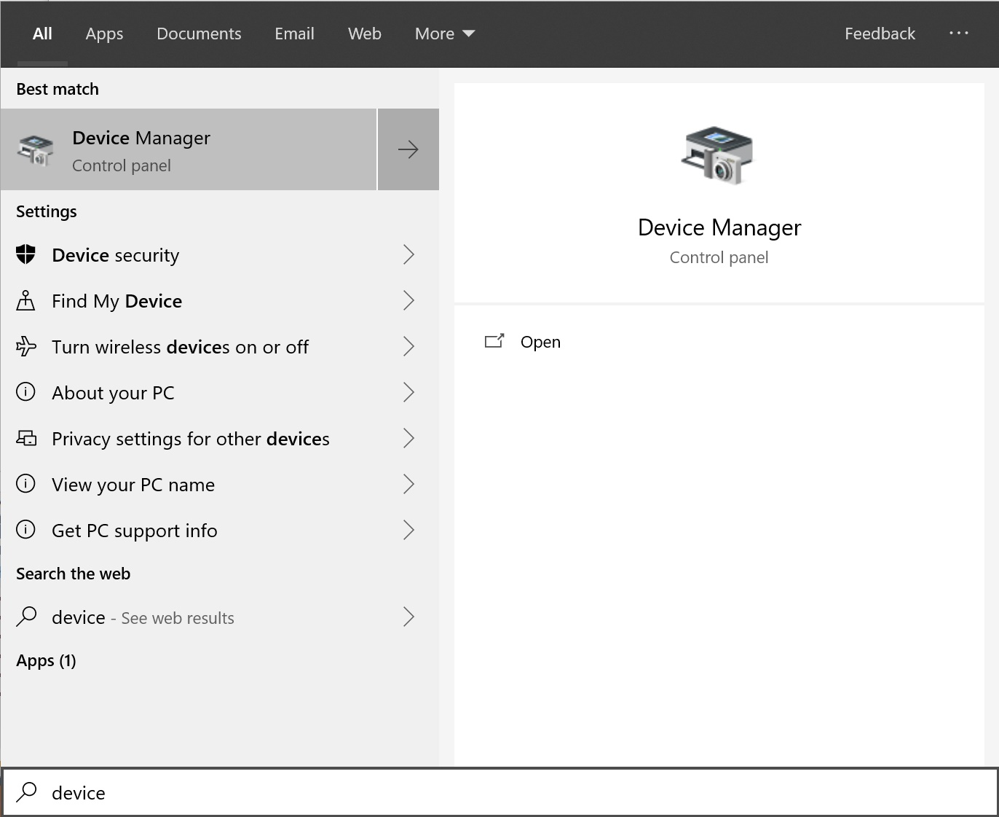
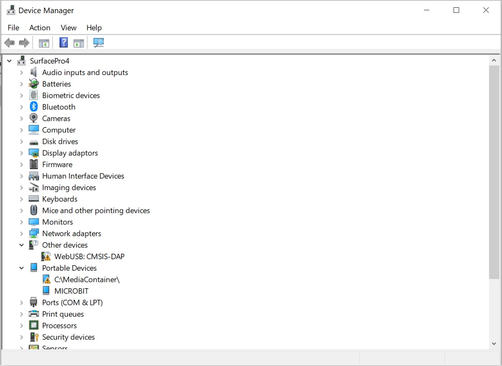
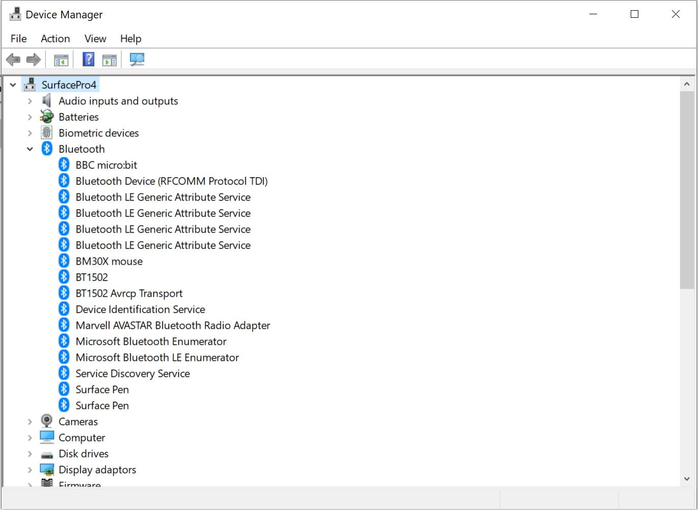
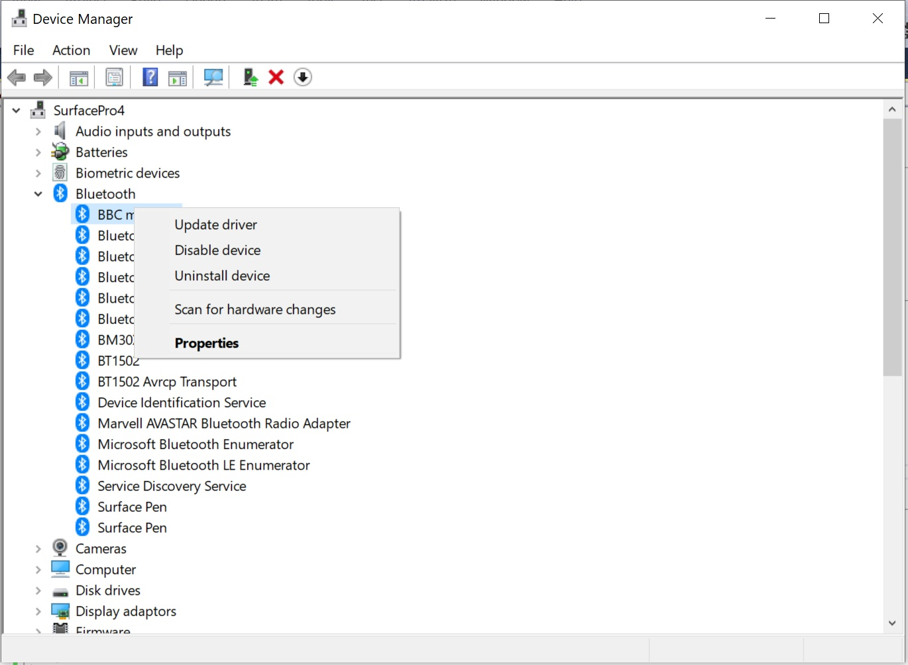
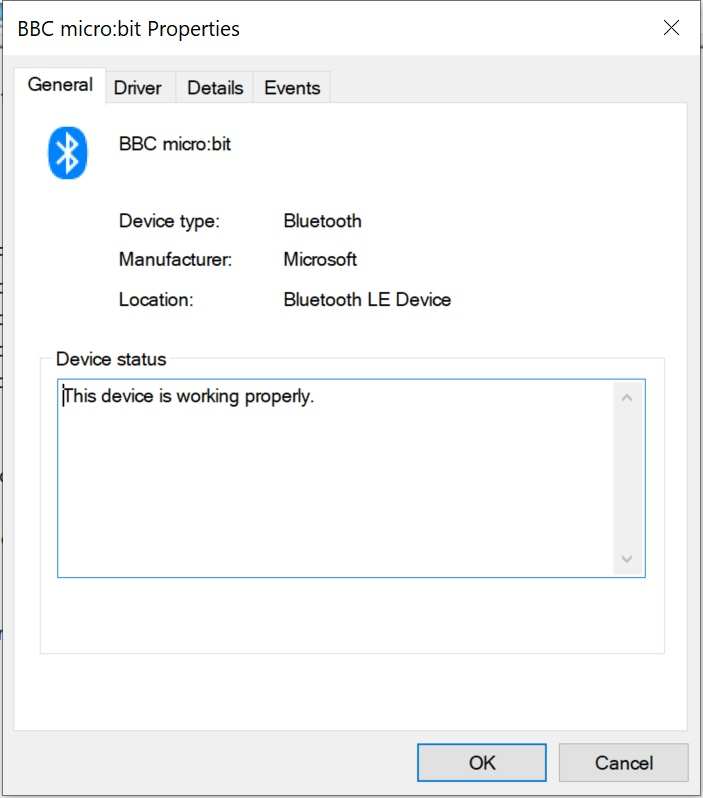
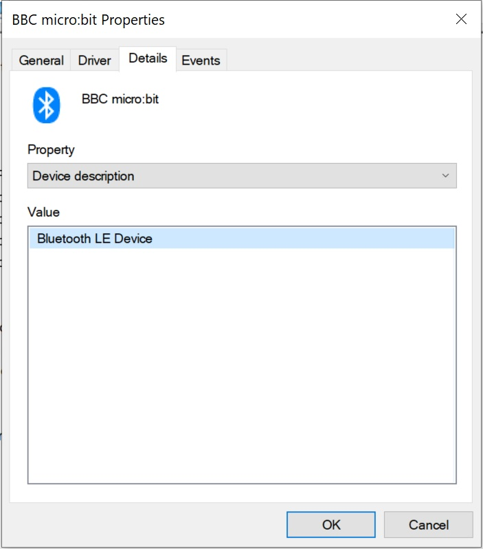
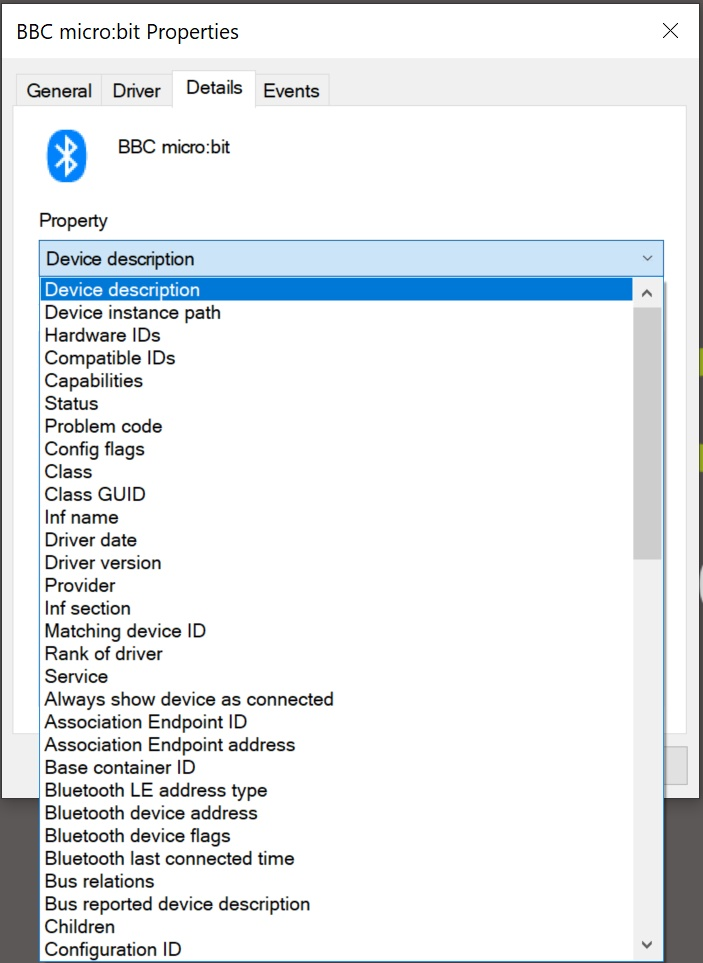
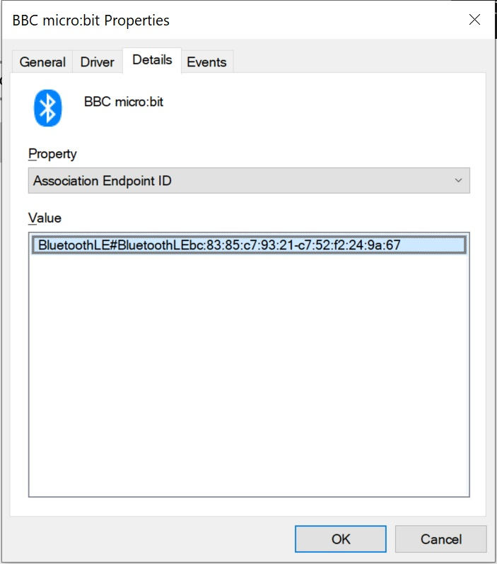
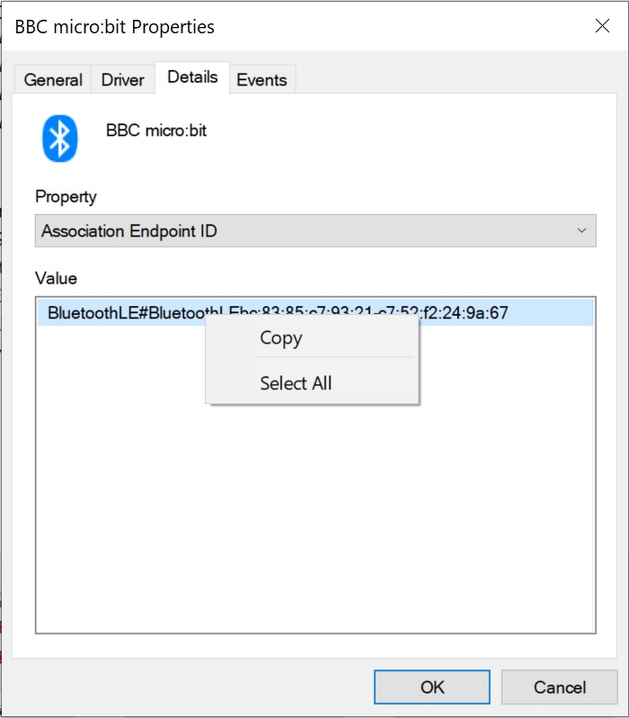

# Radio and Bluetooth #

In this section we'll try out a simple PC Bluetooth Demo Application which allows us to Connect and Disconnect to and from a Paired Micro:Bit.

## Step 10 - Simple PC Bluetooth Demo Program ##

- Open the Micobit Bluetooth Application solution in Visual Studio 2017 and run it;

    

- You'll see that we need to enter an ID for our Micro:Bit. Now that we have aour Micro:Bit paired to the PC, we can retrieve that ID from the Device Manager.
- Press the start button and enter "Device Manager", this will show Device Manager;

    

- Clicking the "Device Manager" item will show the Device Manager Window;

    

- Expand the "Bluetooth" section;

    

- We can see our Micro:Bit as "BBC microbit".
- Right click on the "BBC microbit" item and click the "Properties" menu item;

    

- The BBC Micro:Bit Bluetooth Properties window will be shown;

    

- The BBC Micro:Bit Bluetooth Properties window will be shown;

    

- We now need to grab the Bluetooth Association Endpoint ID...
- Click on the "Details" tab;

    

- Click on the "Property" Drop-Down to reveal the various Device Details options;

    

- Select the "Assosication Endpoint ID" option;

    

- We need to copy the Association Endpoint ID so that we can enter it into the Bluetooth Test Program
- Right click on the "Value" item and click the Copy menu item;

    

- Return to the Bluetooth Test Program and paste in the value into the "Micro:Bit ID" field.
- Pressing the "Connect" button will connect the Bluetooth Test Application to our Micro:Bit.
- The Micro:Bit will now display the icon you chose for the On Bluetooth Connected event.
- Pressing the Disconnect button will display the icon you chose for the On Bluetooth Disconnected Event.

| Previous | Next |
| -------- | ---- |
| [< Step 9 - Micro:Bit Bluetooth](9-microbit-bluetooth.md) |[ Introduction >](/README.md) |