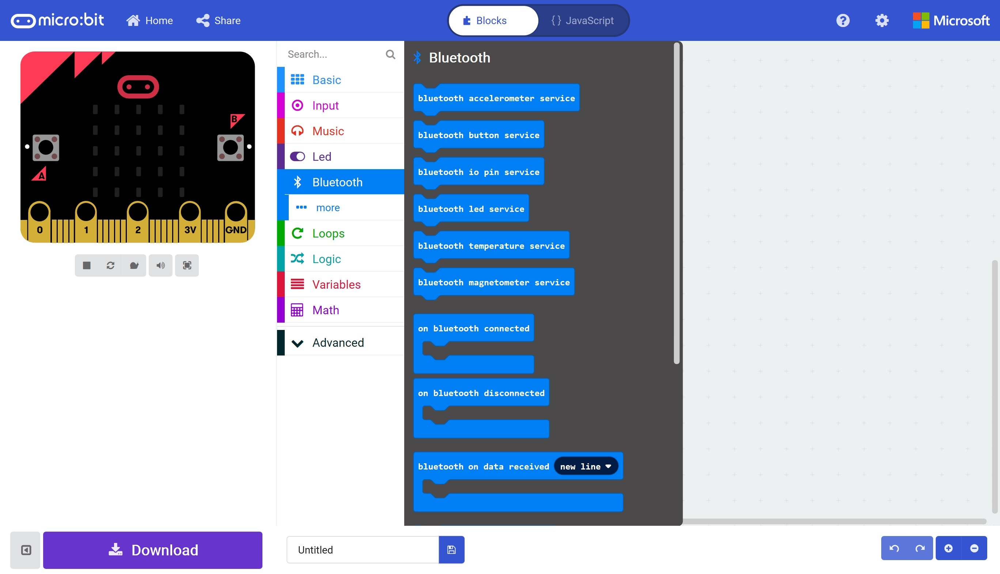

# Radio and Bluetooth #

In this section we'll try out a simple PC Bluetooth Demo Application which allows us to Connect and Disconnect to and from a Paired Micro:Bit.

## Step 10 - Simple PC Bluetooth Demo Program ##

- Open the Micobit Bluetooth Application solution in Visual Studio 2017 and run it;

    

- You'll see that we need to enter an ID for our Micro:Bit. Now that we have aour Micro:Bit paired to the PC, we can retrieve that ID from the Device Manager.
- Press the start button and enter "Device Manager", this will show Device Manager;

    

| Previous | Next |
| -------- | ---- |
| [< Step 8 - Pair the Micro:Bit](8-pair-microbit.md) | [Step 10 - PC Bluetooth Demo >](10-pc-bluetooth-demo.md) |