# Radio and Bluetooth #

In this section we'll try out a the Samsung Micro:Bit app for Android. This app allows you to connect your Micro:Bit to your mobile phone and control both your Micro:Bit from your phone and visa-versa. 

First, we'll create an app to use with the app.

## Step 11 - Samsung Micro:Bit App for Android - Test Program ##

- Hit the Home Button in the top left of the screen;

    

- Click the "New Project" button.

- Click the Settings "Cog" icon in the top right of the screen; 

    

- You should now see the MakeCode Settings Menu;

    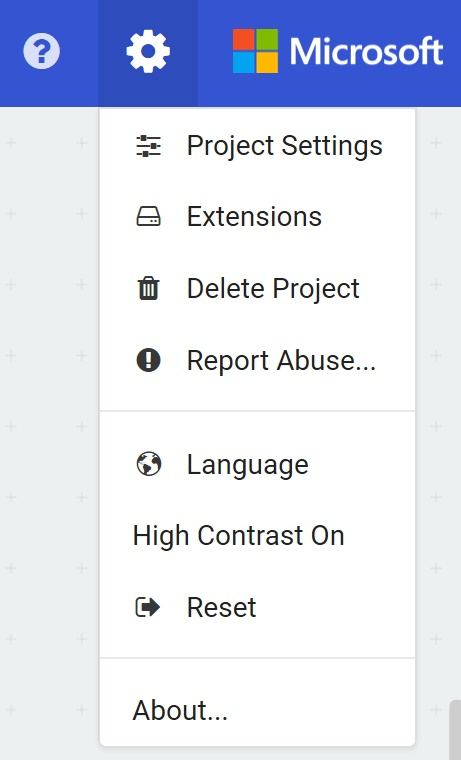

- Click the "Extensions" menu item, which will show the MakeCode Extensions Library;

    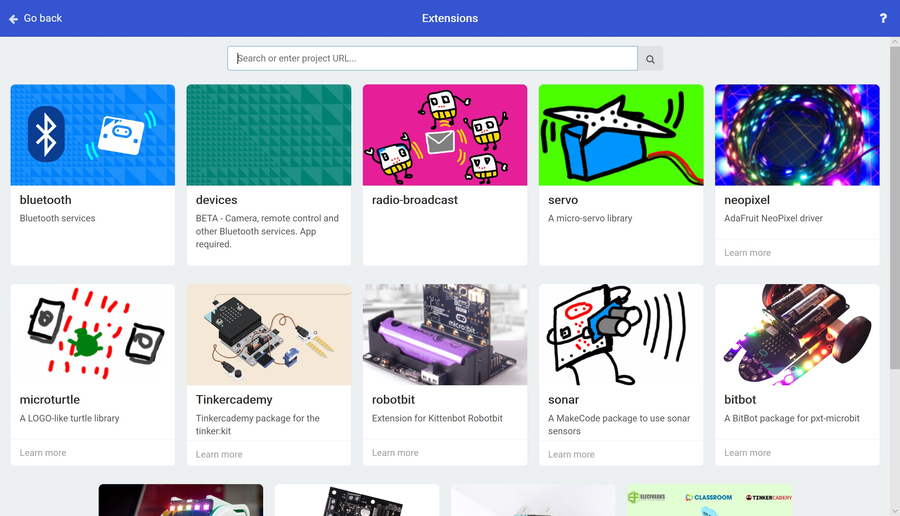

- Click the "Bluetooth" Extension;

    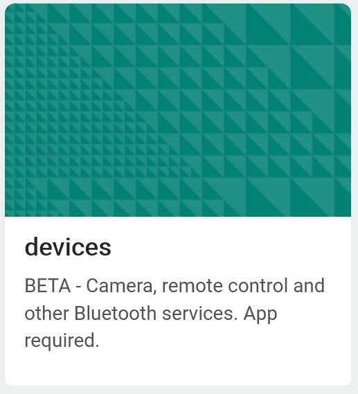

- You'll receive a prompt that MakeCode needs to remove the Radio Extension in order to add the Devices Extension. This is because the Bluetooth Software uses the same hardware as the Radio Software, and they can't both be used at the same time;

    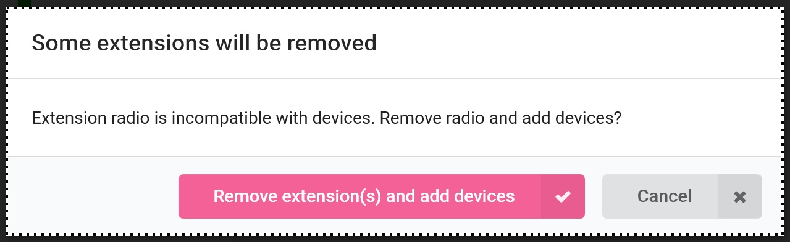

- Press the "Remove extension(s) and add devices" button.
- You will return to the MakeCode Editor, and instead of a Radio Toolbox Section, you'll now have a Bluetooth Toolbox Section and a Devices Toolbox Section;

    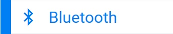

    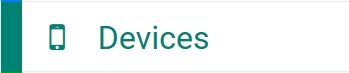

- Expand the Bluetooth Toolbox Section;

    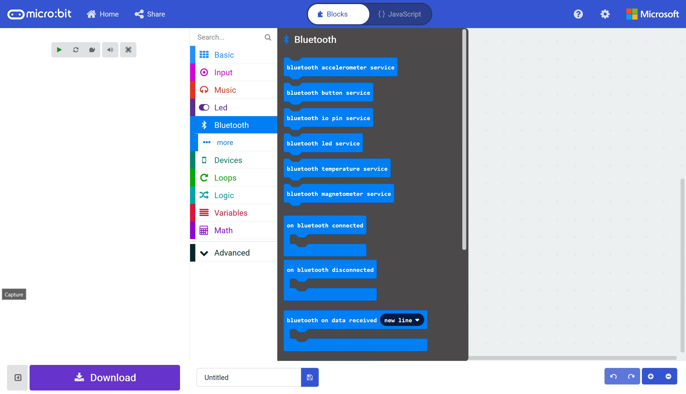

- Drag on an "On Bluetooth Connected" block;

    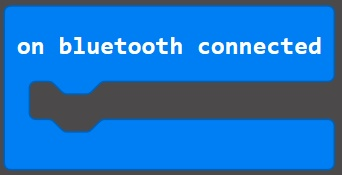

- Add a smiley face icon from the Basic Toolbox to the "On BlueTooth Connected" Block;

    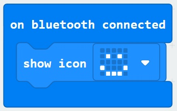

- Expand the Bluetooth Toolbox Section Again.
- Drag on an "On Bluetooth Disconnected" block;

    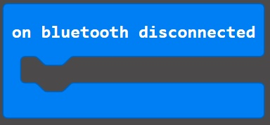

- Add a smiley face icon from the Basic Toolbox to the "On BlueTooth Connected" Block;

    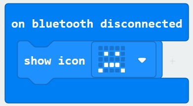

- Name your project and save the HEX file to a location on your computer;

    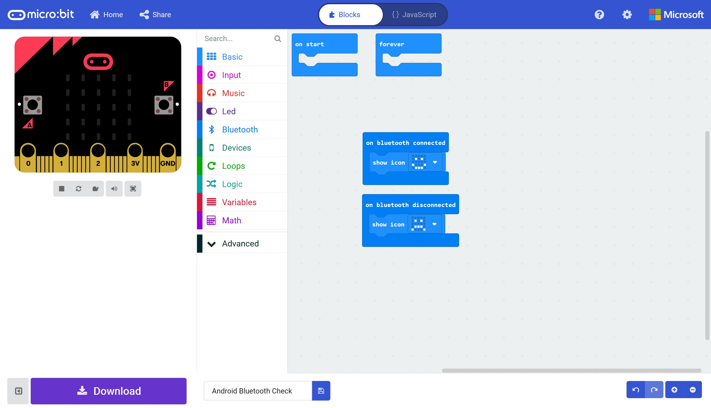

- Program your Micro:Bit with the demo program we've just created.

- You can download an example HEX file here;

<a href="hex/microbit-Bluetooth.hex">Bluetooth</a>

| Previous | Next |
| -------- | ---- |
| [< Step 10 - PC Bluetooth Demo](10-pc-bluetooth-demo.md) |[ Step 12 - Android Micro:Bit App >](12-android-bluetooth-app.md) |