# Radio and Bluetooth #

We'll now install the Samsung Micro:Bit app from the Android App Store...

## Step 12 - Samsung Micro:Bit App for Android ##

- Go to the play store and search for "microbit".
- Open the Samsung micro:bit result;

    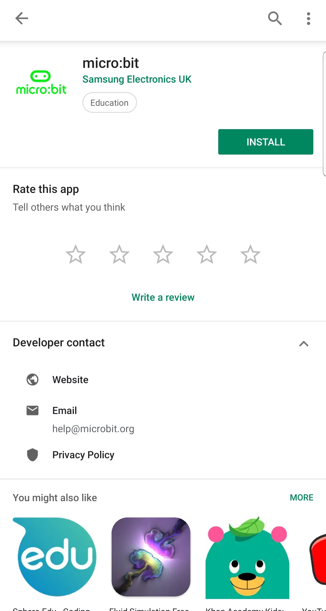

- Install the app.
- Once the app is installed, open the app.
- After the initial loading screens are complete, the app will request permission to store the demo samples on your device;

    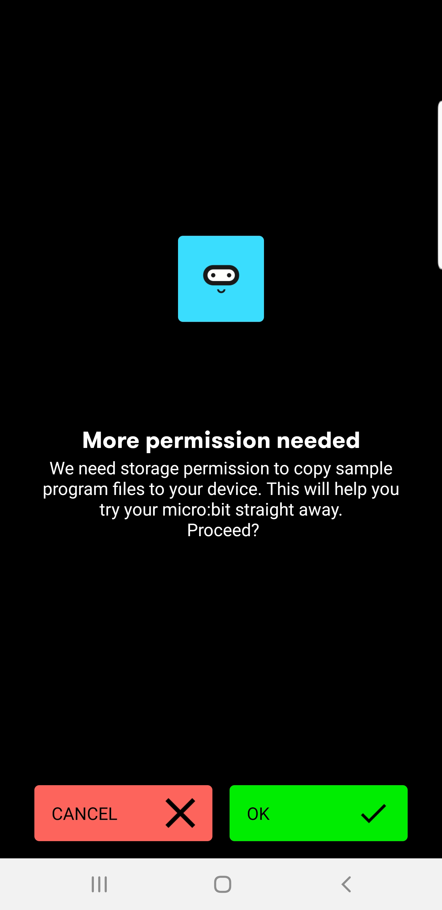

- Click the Green "OK" button.
- The Android System will then ask you to confirm the permissions;

    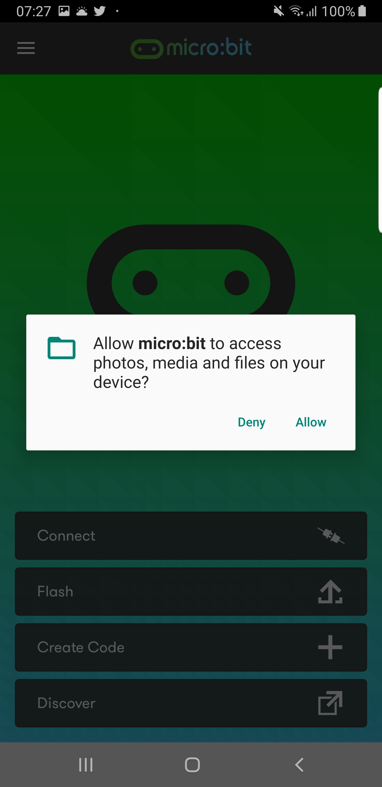

- Press the Allow Button.
- The app will install the demo samples on your device;

    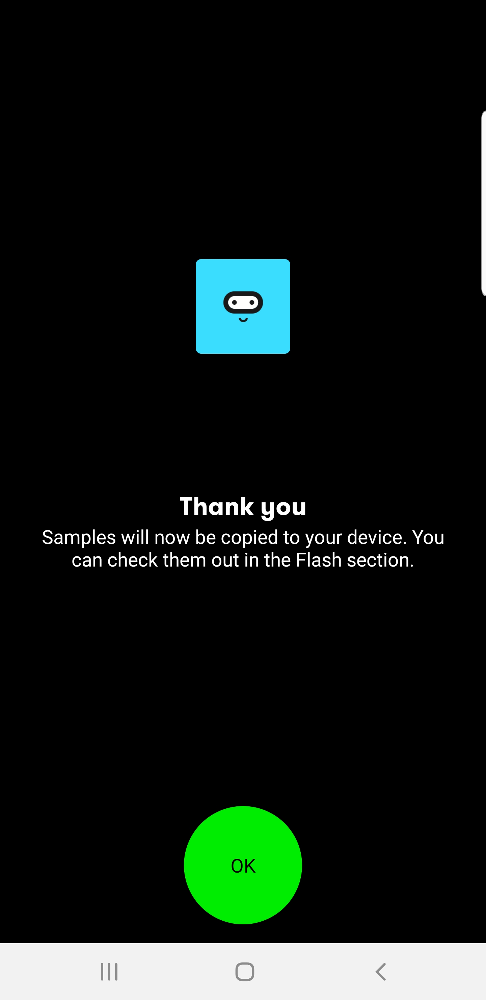

- Press the green "OK" button.
- The main App Screen will be shown;

    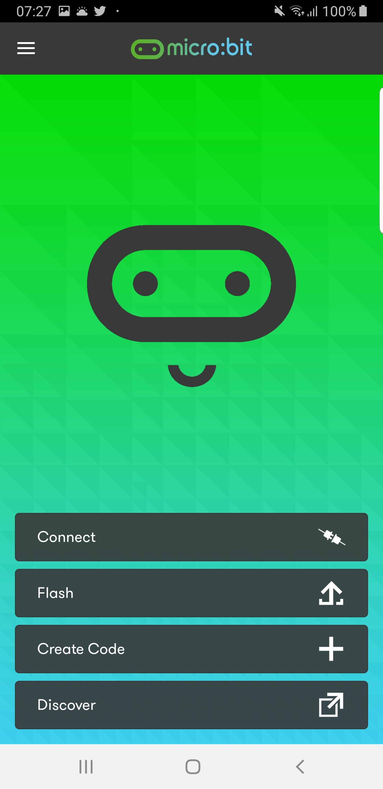

- Press the "Connect" button to show the "Connect" screen;

    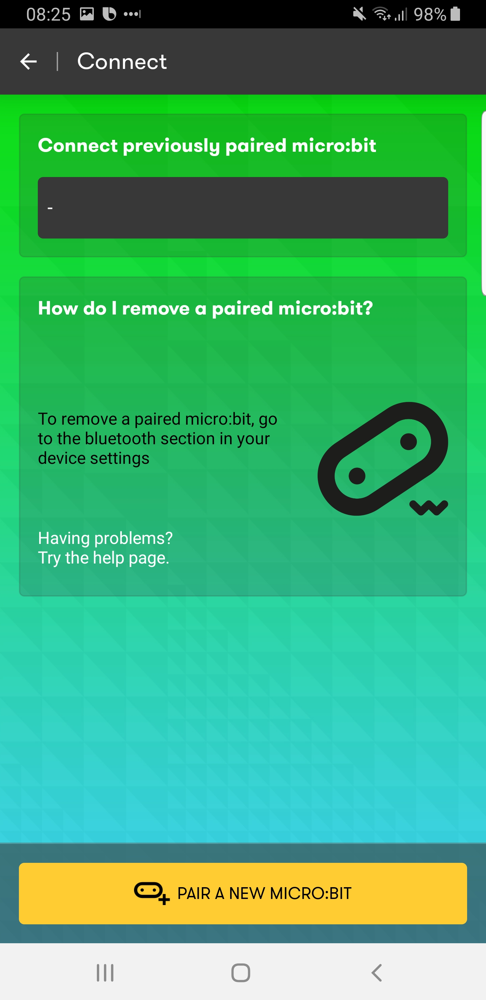

- Press the yellow "Pair a new Micro:Bit" button.
- The app will ask for Location Permissions;

    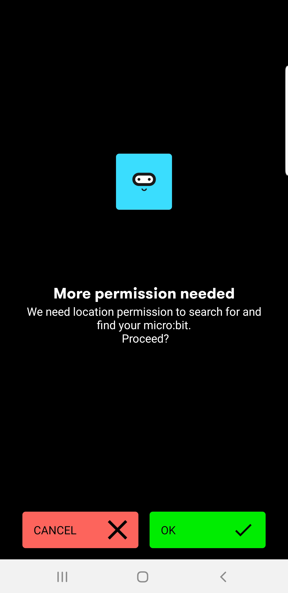

- Press the Green "OK" button.
- The Android System will then ask you to confirm the permissions;

    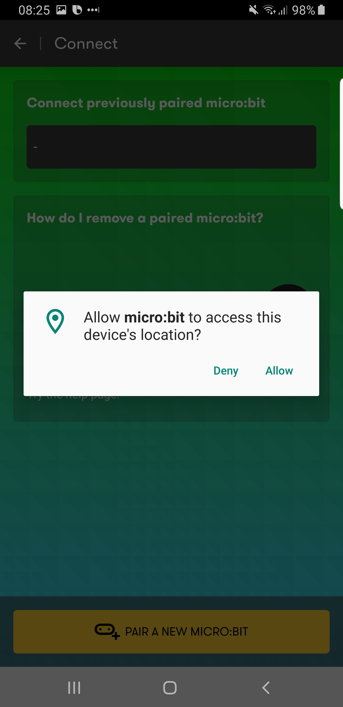

- Press the Allow Button.
- The app will then show you how to enter pairing mode;

    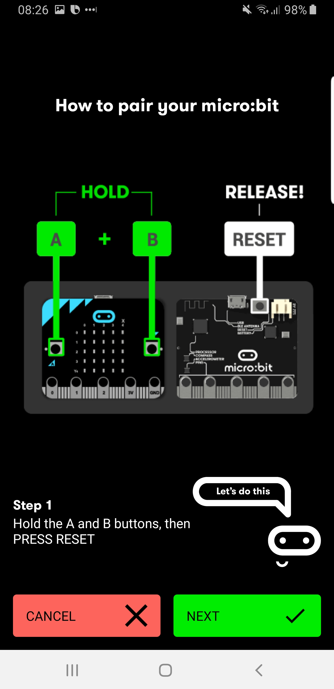

- Follow the instructions on the screen.
- Hold down the A+B Buttons.
- With the A+B Buttons still pressed, press and release the reset button.
- Keep the A+B Buttons pressed until the micro:bit fills the screen with dots and shows your unique pairing image;

    

- In the app, press the green "NEXT" button.
- The app will ask you to enter the pattern shown on your micro:bit;

    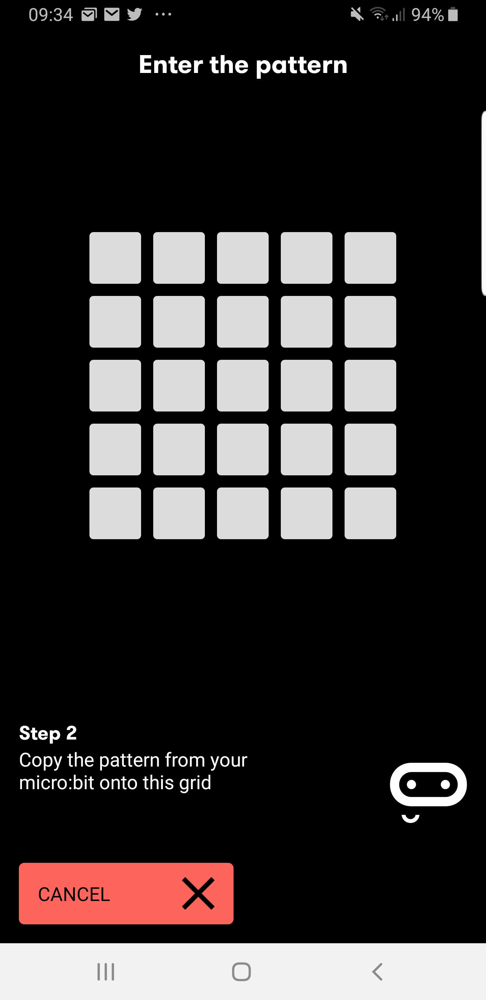

- Enter the pattern shown on your micro:bit screen;

    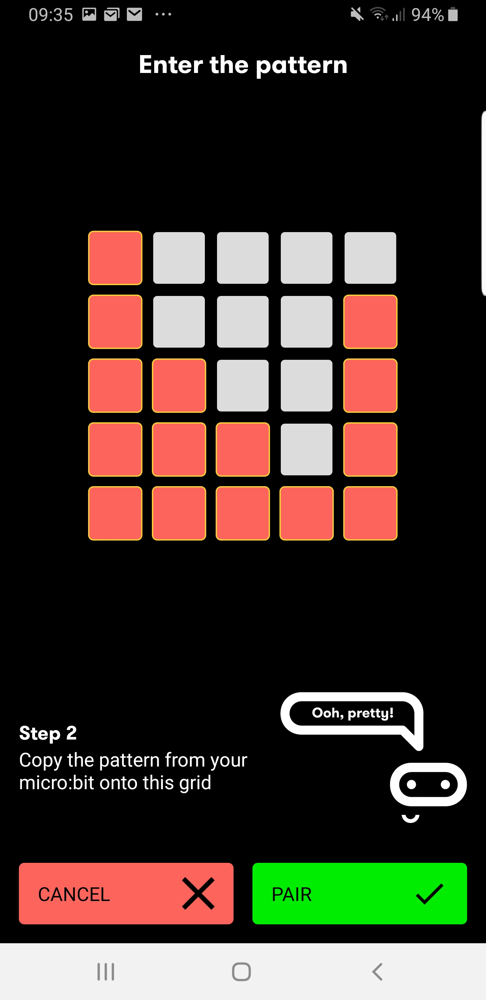

- Press the green "Pair" button.
- The app will start looking for your micro:bit;

    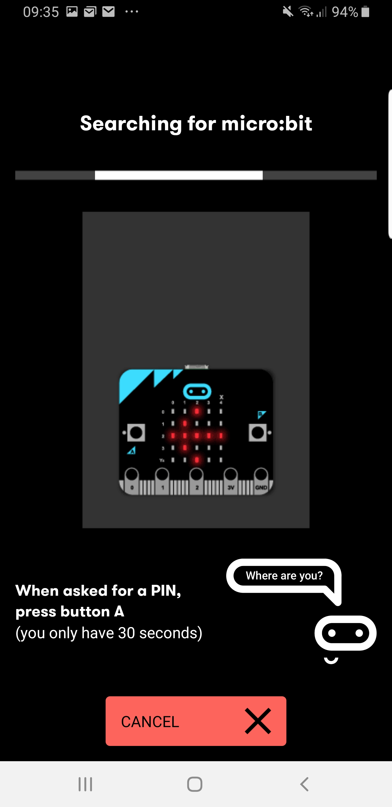

- If everything has worked, then the app will pair your phone to your micro:bit;

    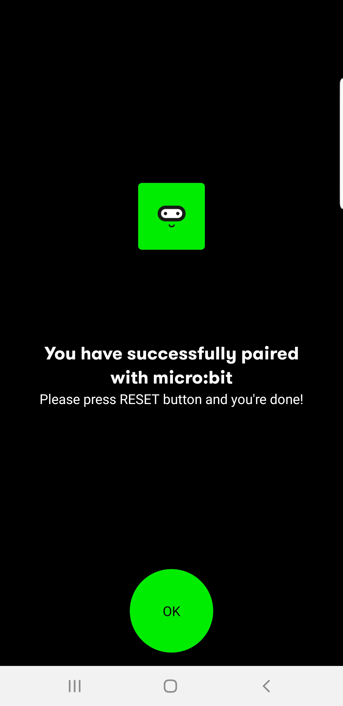

- Press the green "OK" button.
- Your app should now show your paired micro:bit in the "Connect previously paired micro:bit" section at the top of the screen;

    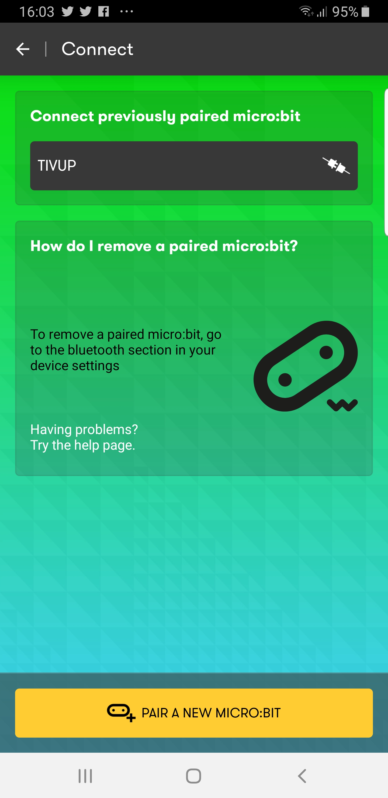

- Click your microbit entry in the list.
- The app will begin to connect to your micro:bit;

    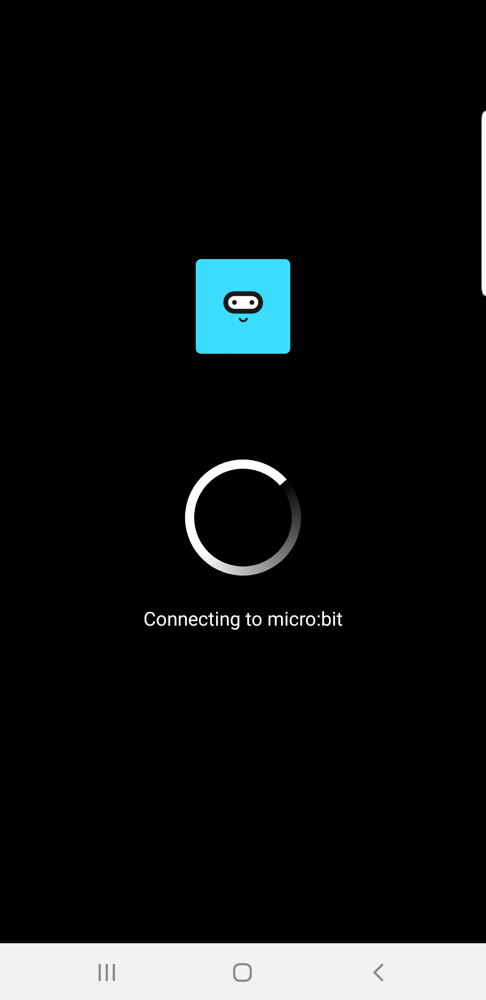

- Once the app connects to your microbit it should show as connected in the app (Denoted by the green icon).

    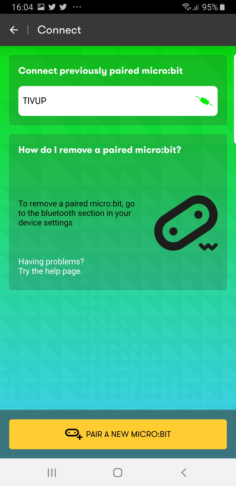

- Your micro:bit should also show the smiley face icon;

    

| Previous | Next |
| -------- | ---- |
| [Step 11 - Andoird Micro:Bit App - Test Program >](11-android-bluetooth-app-program.md) |[ Step 13 - Read Phone Orientation >](13-android-bluetooth-app-orientation.md) |
