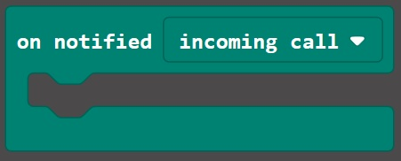
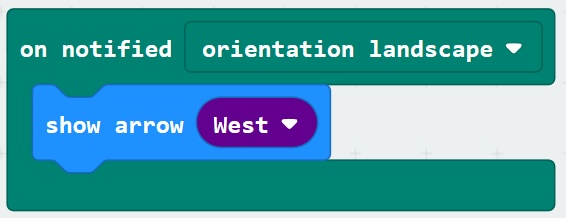
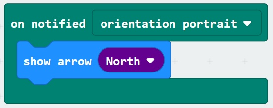
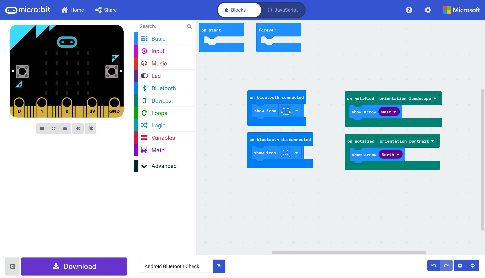

# Radio and Bluetooth #

In this section we'll read our phone's orientation and display it as an arrow on the Micro:Bit screen.

However, every time we flash a new program to our Micro:Bit, it breaks the pairing, so we must unpair and repair our device every time. 

First though, we'll create and flash an app to the Micro:Bit...

## Step 13 - Reading the Phone's Orientation ##

- Return to your Android Bluetooth program in MakeCode;

    

- Click on the Devices Toolbox Section.
- Drag a "On Notified (Incoming Call)" block onto the designer;

    

- Change the "Incoming Call" to "Orientation Landscape.
- Click the Basic Toolbox Section and press the "more" Section to show more "Basic" blocks.
- Drag a  "Show Arrow (North)" block ont the "On Notified (Orientation Landscape)" block;

    

- Change the "North" to "West";

    

- Click on the Devices Toolbox Section again.
- Drag another "On Notified (Incoming Call)" block onto the designer.
- Change the "Incoming Call" to "Orientation Portrait").
- Open the Basic TOolbox and "more" section again.
- Drag another "Show Arrow (North)" block onto the "On Notified (Orientation Portrait)" block;

    

- Your program should look like the following;

    

- Save your project and download the HEX file to a location on your computer.
- Flash the HEX file to your Micro:Bit.

| Previous | Next |
| -------- | ---- |
| [< Step 12 - Andoird Micro:Bit App - Test Program](12-android-bluetooth-app.md) |[ Step 14 - Re-Pair the Micro:Bit >](14-android-bluetooth-re-pair.md) |