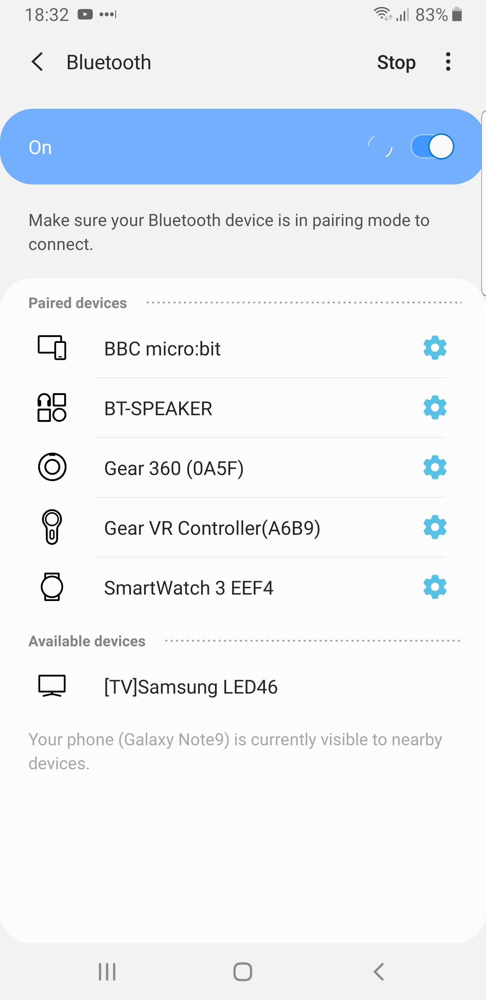
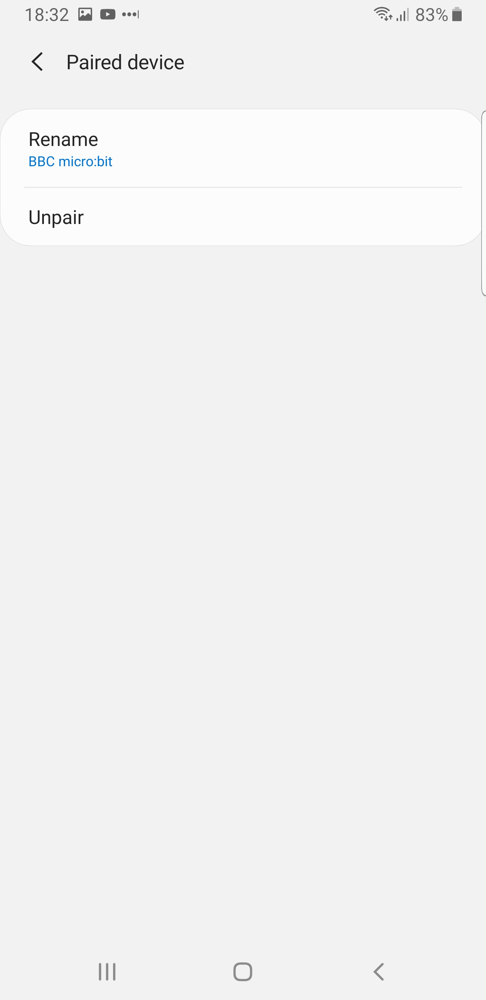
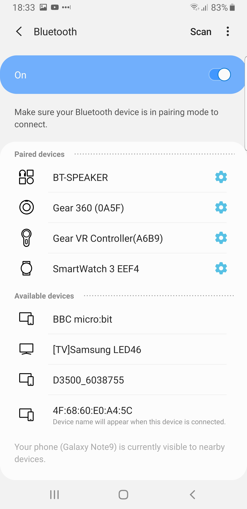

# Radio and Bluetooth #

There's currently an issue with Bluetooth connections from the Micro:Bit, where everytime a new program is flashed into the Micro:Bit it breaks the Bluetooth Pairing.

As a result, you need to un-pair and re-pair your micro:bit each time you flash a new version of code to it.

## Step 14 - Samsung Micro:Bit App Re-Pairing ##

- Go to your phone's BLuetooth Settings;

    

- Go to the settings for the "BBC micro:bit";

    

- Press the "Unpair" button.
- Your Micro:Bit should be unpaired;

    

- Return to your Micro:Bit Android Application.
- Run through this again 
    - [ Step 12 - Android Micro:Bit App](12-android-bluetooth-app.md)

- Now rotate your phone, and you should see the Micro:Bit display show the orientation of your phone.

| Previous | Next |
| -------- | ---- |
| [Step 13 - Read Phone Orientation >](13-android-bluetooth-app-orientation.md) |[ Introduction >](/README.md) |
