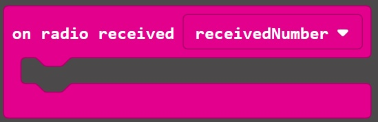
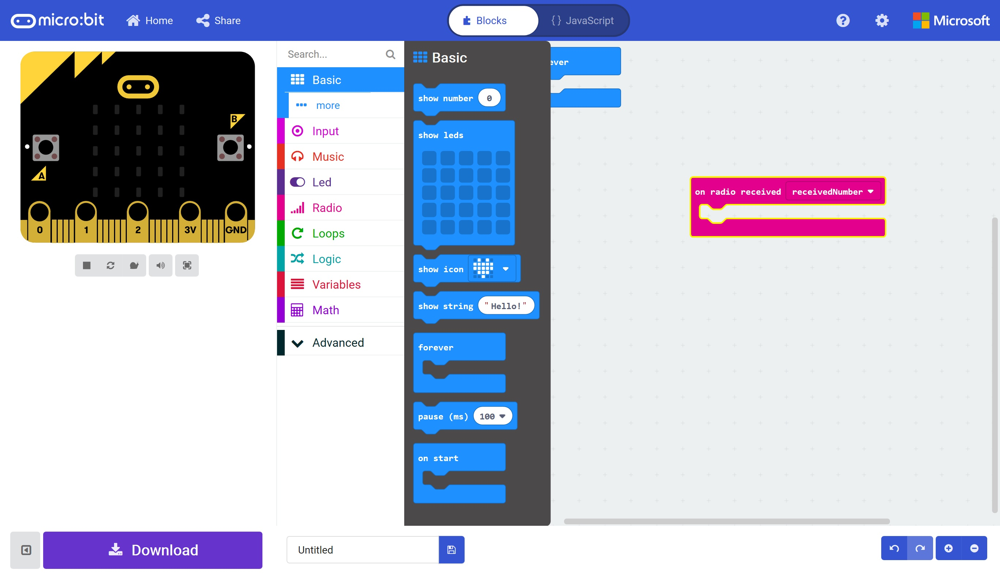
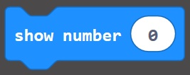
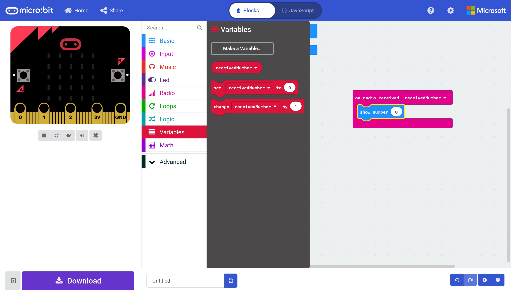
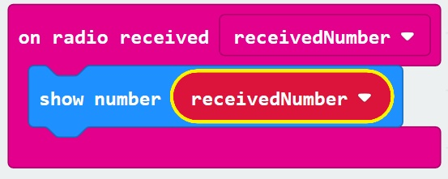

# Radio and Bluetooth #

## Step 5 - On Radio Received ##

- Drag a "On Radio Received (Recieved Number)" Block onto the designer;

    

- Open the Basic Toolbox;

    

- Drag a "Show Number (0)" block on to the new "On Radio Received" block;

    

- Open the Variables Toolbox;

    

- Drag the "receivedNumber" block onto the 0 section of the new "show number" block;

    

- You should have a "on received number block" that looks like this;

    

| Previous | Next |
| -------- | ---- |
| [< Step 4 - Radio Toolbox](4-radio-toolbox.md) | [Step 6 - Radio Send Number >](6-radio-send-number.md) |