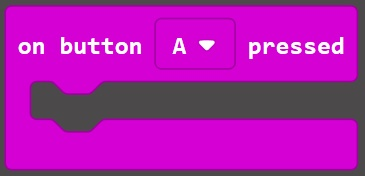
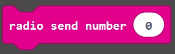
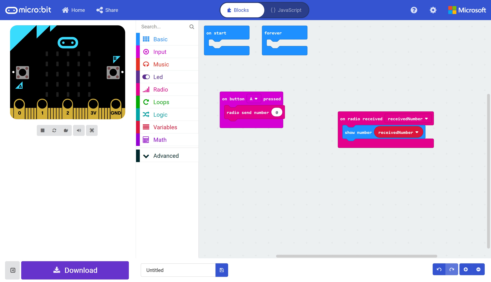
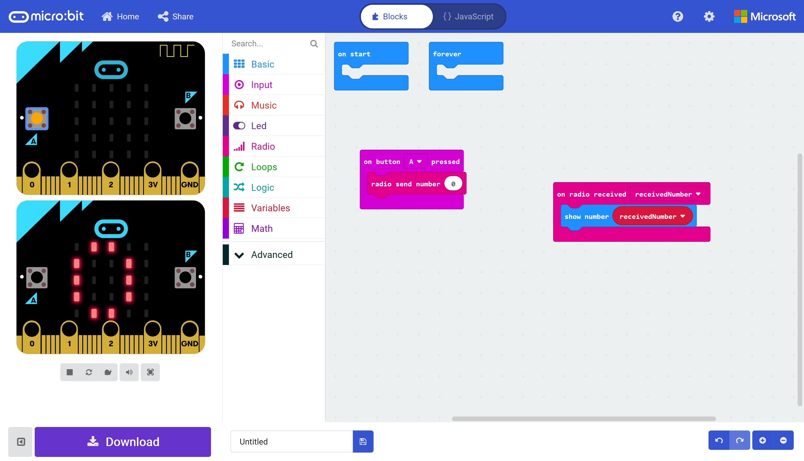
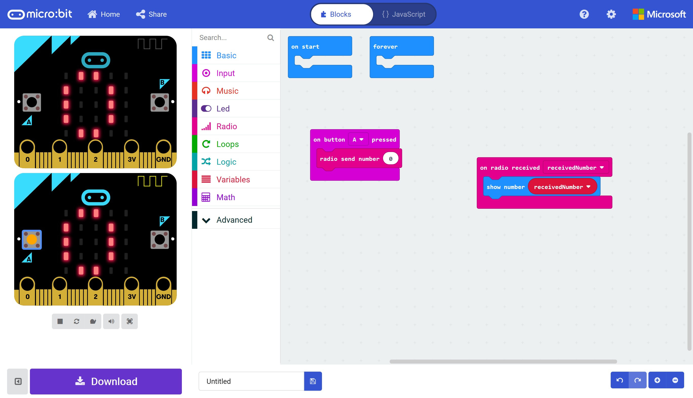

# Radio and Bluetooth #

## Step 6 - Radio Send Number ##

- Open the Input Toolbox Section.
- Drag an "On Button (A) Pressed" block onto the designer;

    

- Open the Radio Toolbox again.
- Drag a "Radio Send Number (0)" Block onto the "On Button (A) Pressed" block;

    

- You should now have something resembling the following; 

    

- Go ahead and press the A Button on the Micro:Bit... You'll see the Antenna on the First Micro:Bit light up, a second Micro:Bit appear and show a 0 on it's display;

    

- If you press the A button on the second Micro:Bit, you should also then see the reverse, with the first Micro:Bit showing a 0 too;

    

- Once again, go ahead and give your project a name and save it.

- Here's an example;

https://makecode.microbit.org/_T5UaoK9R3d5z

| Previous | Next |
| -------- | ---- |
| [< Step 5 - Radio Received](5-radio-received.md) | [Step 7 - New Bluetooth Project >](7-new-project-bluetooth.md) |