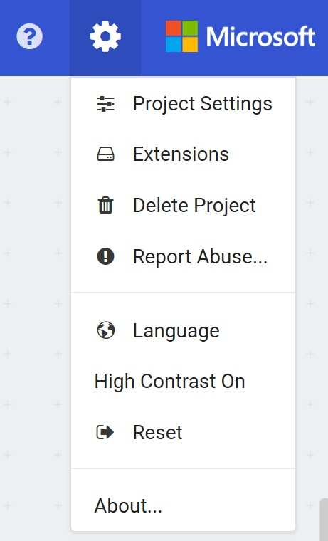

# Radio and Bluetooth #

## Step 7 - New Project and Add Bluetooth ##

- Hit the Home Button in the top left of the screen;

    

- Click the "New Project" button.

- Click the Settings "Cog" icon in the top right of the screen; 

    

- You should now see the MakeCode Settings Menu;

    

- Click the "Extensions" menu item, which will show the MakeCode Extensions Library;

    

- Click the "Bluetooth" Extension;

    

- You'll receive a prompt that MakeCode needs to remove the Radio Extension in order to add the Bluetooth Extension. This is because the Bluetooth Software uses the same hardware as the Radio Software, and they can't both be used at the same time;

    

- Press the "Remove extension(s) and add bluetooth" button.
- You will return to the MakeCode Editor, and instead of a Radio Toolbox Section, you'll now have a Radio Toolbox Section;

    

| Previous | Next |
| -------- | ---- |
| [< Step 6 - Radio Send Number](6-radio-send-number.md) | [Step 8 - New Project >](8-new-project.md) |