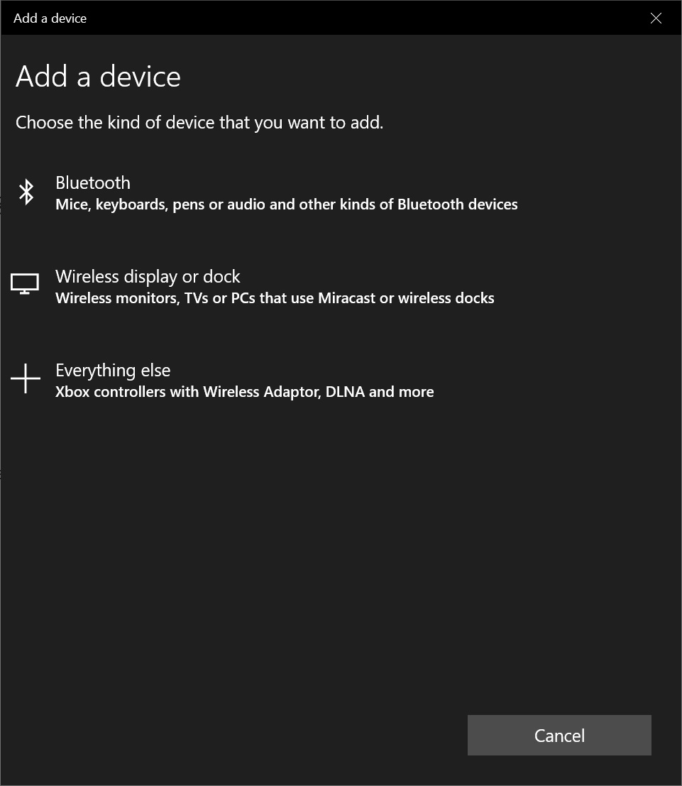

# Radio and Bluetooth #

In this section we'll pair our Micro:Bit to a PC to test the basic Bluetooth functionality.

We'll explain here how to pair your Micro:Bit... There's also a guide on the official Micro:Bit site here;

https://support.microbit.org/support/solutions/articles/19000051025

## Step 8 - Pairing the Micro:Bit ##

- The first thing we need to do is place our Micro:Bit into Pairing mode.
- To do this, with the power connected, press and hold the reset button which is located near the USB Socket;

    

- Now press and hold both the A and B Buttons;

    

- Release the Reset button while still holding the A and B Buttons and the display will quickly fill with dots;

    

- Once the screen fills with dots, the Micro:Bit will enter Pairing Mode and display a special icon; 

    

- At this point, the Micro:Bit is ready to pair to your PC...
- Press the Start button and type "Bluetooth", you should the "Bluetooth and other Devices Settings" option appear;

    

- Select "Bluetooth and other Devices Settings" and you'll be shown the following window;

    

- Press the "Add Bluetooth or Other Device" button to show the "Add a Device" window;

    

- Press the "Bluetooth" button at the top of the list to start scanning of Bluetooth Devices... You should see your Micro:Bit appear in the list of devices;

    

- Click your Micro:Bit in the list of devices, Windows will begin connecting;

    

- Once windows has completing the connection the window will show "Your device is ready to go!";

    

- Your Micro:Bit will also show a "Tick" Icon to indicate that it is paired successfully;

    

| Previous | Next |
| -------- | ---- |
| [< Step 7 - New Project Bluetooth](7-new-project-bluetooth.md) | [Step 9 - Micro:Bit Bluetooth Code >](9-microbit-bluetooth.md) |