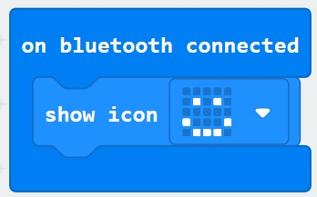

# Radio and Bluetooth #

In this section we'll add some simple blocks that will show an icon when the Micro:Bit is connected via Bluetooth. Likewise, we'll show an icon when the Bluetooth disconnects.

## Step 9 - Simple Bluetooth Code ##

- Click the Bluetooth Toolbar Section;

    

- Drag an "On Bluetooth Connected" block onto the designer;

    

- Open the Basic Toolbox Section and drag an icon onto the "On BLuetooth Connected" block;

    

- Open the Bluetooth Toolbox Section again and drag a "On Bluetooth Disconnected" block onto the designer; 

    

- Open the Basic Toolbox Section again, and drag another icon onto the "On Bluetooth Disconnected" block... Go ahead and change the icon to something different;

    

- You should now have something similair to the below;

    

- Give your project a name, download the HEX file and flash it to your Micro:Bit.

| Previous | Next |
| -------- | ---- |
| [< Step 8 - Pair the Micro:Bit](8-pair-microbit.md) | [Step 10 - PC Bluetooth Demo >](10-pc-bluetooth-demo.md) |