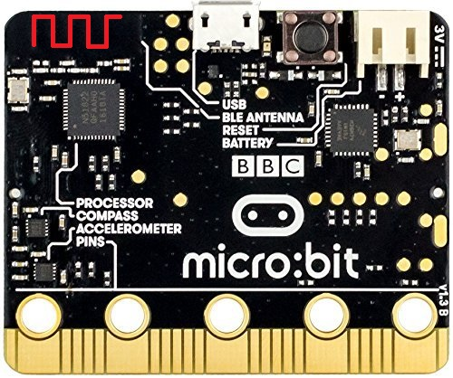
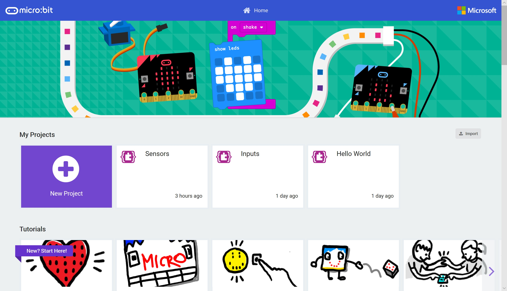

# Radio and Bluetooth #

In this section we're going to explore the Wireless Communication functions of the Micro:Bit.

The Micro:Bit has a built in Radio Antenna (shown in the top left hand corner) which can be used to communicate between Micro:Bits and also via Bluetooth to a Phone or Desktop;

    

----

## Step 1 - Return to MakeCode ##

- Goto [MakeCode](https://makecode.microbit.org)

    

- You'll notice your "Sensors" (or whatever you called it!) project is now visible.

| Previous | Next |
| -------- | ---- |
| [< Introduction](/README.md) | [Step 2 - New Project >](2-new-project.md) |
