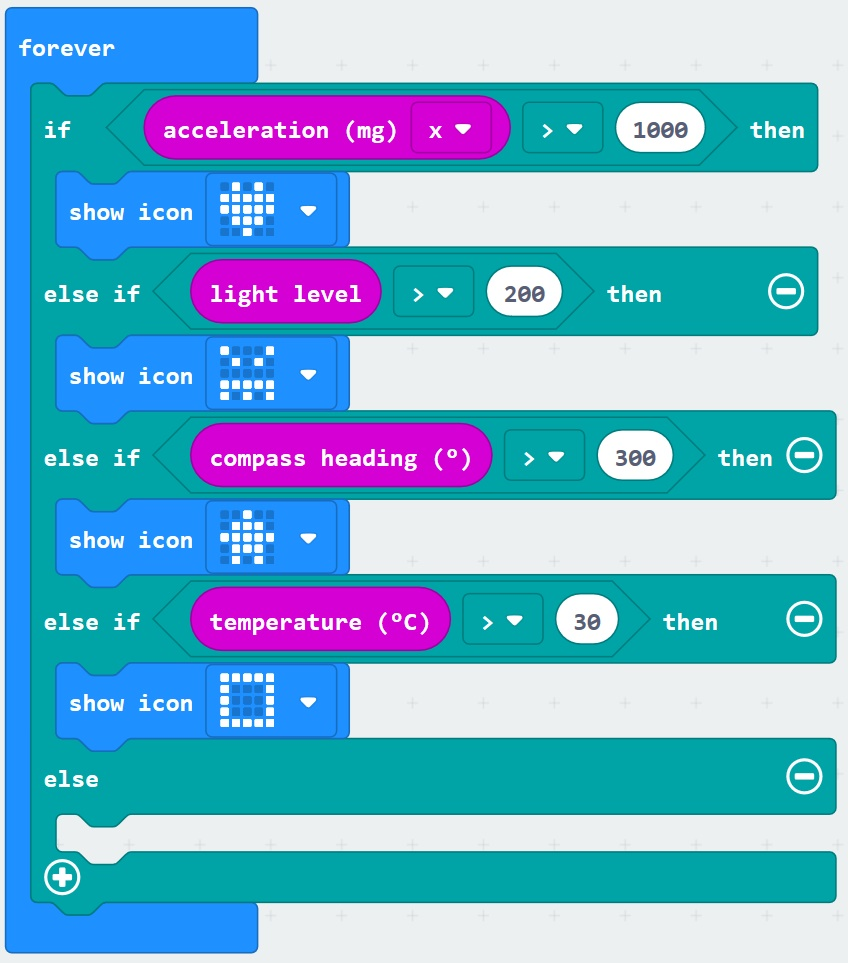

# Sensors and Logic - Temperature Reading #

Here we are going to add a block to read the Micro:Bit Temperature Sensor and give us a reading on the screen if the amount read is over a given threshold.

----

## Step 9 - Add Temperature Reading ##

- You should currently have a "Forever" Block similair to the following;

    

- Add another "Else If" by clicking the small plus "+" at the bottom of the "If Else" Block.

- Click the "Logic" Toolbox Section again;
- Drag another "Comparison" block onto the "Forever" block on the designer;
- Click the "Equals" or "=" operator and choose the "Greater Than" or ">" operator;
- Click the "Input" Toolbox Section;
- Drag a "Temperature (°C)" block onto the first "0" section of the Comparison Logic Block you added;

    

- Change the second "0" in the Comparison Logic Block to 30;
- Drag an "Icon" block into the new "Else If" Block;
- Click the Heart Icon in the new "Icon" block and select a new icon image;
- You should now have a Forever block resembling the following;

    

| Previous | Next |
| -------- | ---- |
| [< Step 9 - Add Compass Value](9-add-compass-value.md) | [Step 11 - Add Clear Screen >](11-clear-screen.md) |