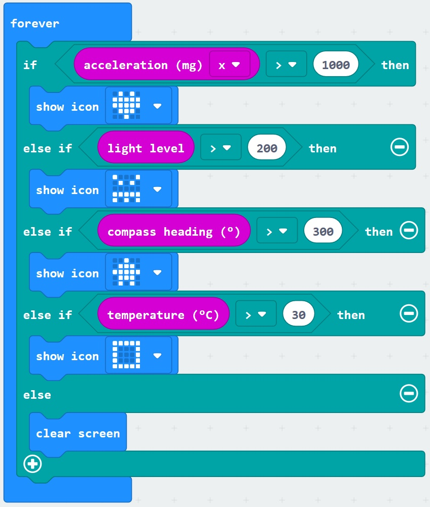

# Sensors and Logic - Clear Screen #

Here we are going to add a block to clear the screen if non of the sensors have breached their thresholds...

----

## Step 11 - Add a Clear Screen Block ##

- You should currently have a "Forever" Block similair to the following;

    

- Click the "Basic" Toolbox Section.
- Click the "...More" section below, this will show some extra blocks;

    

- Drag a "Clear Screen" block into the final "Else" section at the end of the forever block;

    

- You should now have a Forever block resembling the following;

    

| Previous | Next |
| -------- | ---- |
| [< Step 11 - Add Clear Screen](11-add-clear-screen.md) | [ Step 12 - Testing>](12-testing.md) |