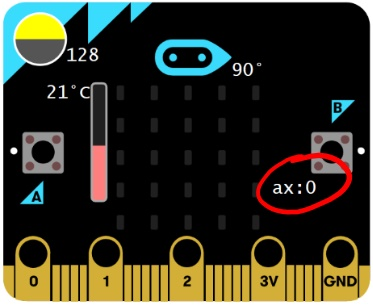

# Sensors and Logic - Testing #

Now it's time to do a little testing to see what we've set our Micro:Bit up to do...

## Step 12 - Testing ##

- You'll notice that we now have a bunch of extra icons on our Micro:Bit simulator;

    

## Acceleration ##

- For the Acceleration, we have a "ax:0" reading on the right hand side below the B Button;

    

- The Acceleration we're measuring currently is in the X-Axis, and will read from -1023 by hovering over the A Button;

    

- Hovering over the B Button produces a reading of +1024. You'll see when you do this, that as the reading has breached the 1000 limit we set earlier, your Acceleration icon should be shown. 

    

Likewise, letting the Micro:Bit return to centre clears the screen as expected.

    

## Light Level ##

- For the Light Level, we have a "Light Level" Circle above the A Button on the left hand side;

    

- The Light Level can be changed by dragging the horizontal line vertically up and down. Dragging to the top will produce a reading of 0 (No Light);

    

- Dragging to the bottom will produce a reading of 255 (Max Light). You'll see when you do this that your Max Light Icon will be shown as we pass the 200 threshold we set;

    

- Dragging the Light Level back down again will once again clear the screen.

## Compass Heading ##

- For the Compass Heading, we have a "Compass Heading" Needle above the Display LEDs at the top;

    

- The Compass Heading can be changed by rotating the Compass Needle around in a circle. Pointing the needle vertically to the top of the Micro:Bit results in a reading of 0°;

    

- Rotating clockwise will give readings upto 359°, anything over 300° will show the icon you chose for the Compass Threshold;

    

- Rotating further clockwise will wrap back to 0° and of course clear the screen again.

## Temperature ##

- For the Temperature Reading, we have a "Temperature" Guage between the A button and the Display LEDs;

    

- The Temperature Reading can be changed by Dragging the bar vertically up and down... Dragging the bar to the bottom will result in a reading of -5°C;

    

- Dragging the Bar to the Top will give a reading of 50°, anything over 30° will show the icon you chose for the Temperature Threshold;

    

- Dragging the Temperature Bar back down will clear the screen again.

| Previous | Next |
| -------- | ---- |
| [< Step 11 - Add Clear Screen](11-add-clear-screen.md) | [ Introduction >](/README.md) |