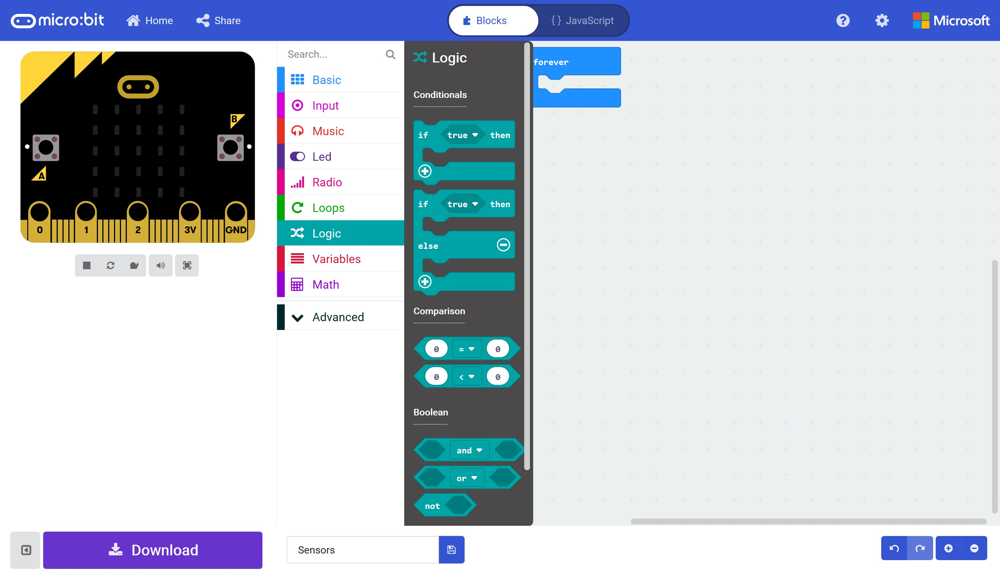

# Sensors and Logic #

## Step 4 - The Logic Toolbox ##

Click the "Logic" section in the toolbox

    

| Previous | Next |
| -------- | ---- |
| [< Step 3 - MakeCode Editor](3-makecode-editor.md) | [Step 5 - Add If Else Block >](5-button-a-pressed.md) |