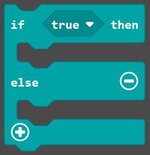

# Sensors and Logic #

## Step 5 - The If Else Block ##

Drag an "If Else" block onto the "Forever" block on the designer;

    

| Previous | Next |
| -------- | ---- |
| [< Step 4 - Logic Toolbox](4-logic-toolbox.md) | [Step 6 - Add Comparison >](6-add-acc-comparison.md) |