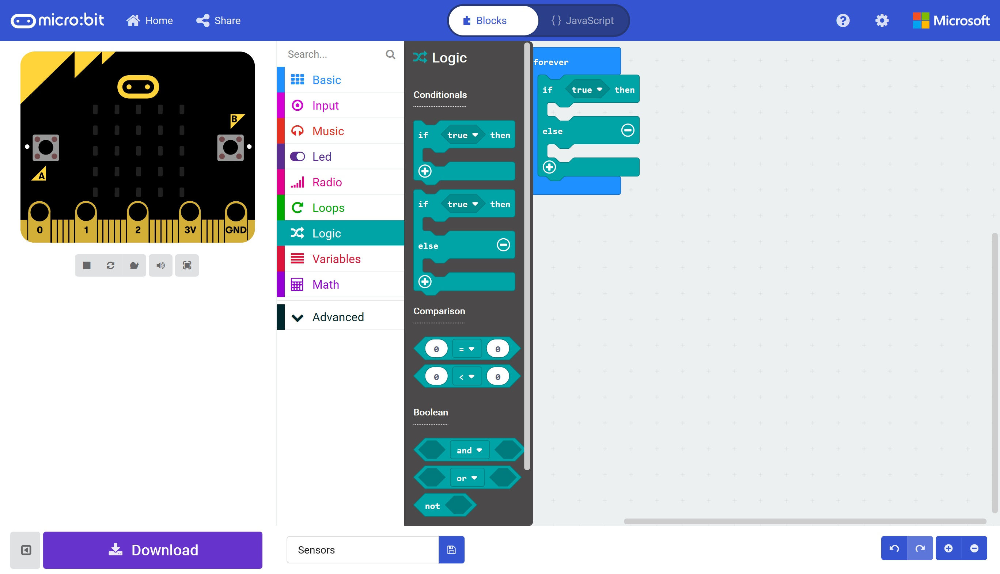
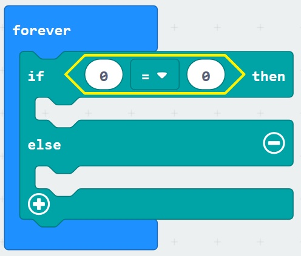
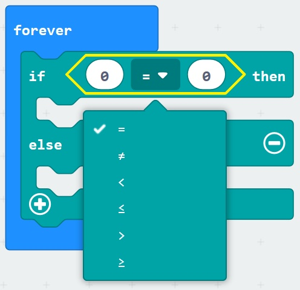

# Sensors and Logic #

## Step 6 - Add Comparison for Acceleration ##

Click the "Logic" section in the toolbox again;

    

- Drag a "Comparison" block onto the "Forever" block on the designer;

    

- Which will show the following;

    

- Click the "Equals" or "=" operator and choose the "Greater Than" or ">" operator;

    

| Previous | Next |
| -------- | ---- |
| [< Step 5 - If Else Block](5-if-else-block.md) | [Step 7 - Add Acceleration Value >](7-add-acceleration-value.md) |