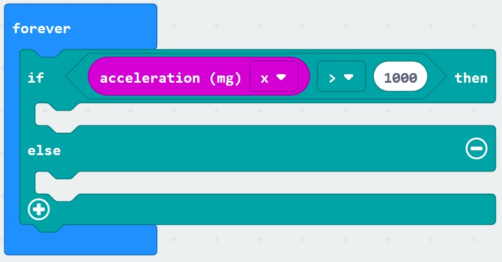
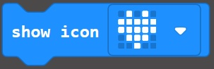
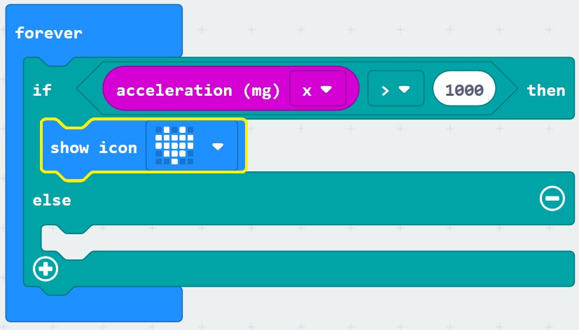

# Sensors and Logic - Accelerometer #

Here we are going to add a block to read the Micro:Bit Acceleration Sensor and give us a reading on the screen if the amount read is over a given threshold.

This Accelerometer Sensor detects when the Micro:Bit is tilted or moved up and down, and can be set to read a number of different types of acceleration;

- X - The amount the Micro:Bit is tilted from Side to Side
- Y - The amount the Micro:Bit is tilted from Front to Back
- Z - The amount the Micro:Bit is moved Up and Down 

----

## Step 7 - Add Acceleration Value ##

- Click the "Input" Toolbox Section;

    

- Drag an "Acceleration (mg)" block onto the first "0" section of the Comparison Logic Block you added in the previous section;

    

- You should have a forever block like the following;

    

- Change the second "0" in the Comparison Logic Block to 1000;

    

- Open the "Basic" Toolbox Section;

    

- Drag an "Icon" block into the first If Block;

    

- You should now have a Forever block resembling the following;

    

| Previous | Next |
| -------- | ---- |
| [< Step 6 - Add Acceleration Value](6-add-acceleration-value.md) | [Step 8 - Add Light Level Value >](8-add-light-level-value.md) |