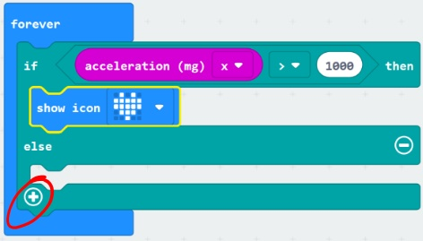
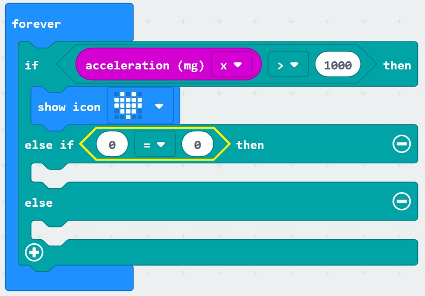
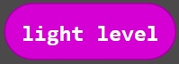

# Sensors and Logic - Light Level #

Here we are going to add a block to read the Micro:Bit Light Sensor and give us a reading on the screen if the amount read is over a given threshold.

The Light Level Sensor actually works by sensing the light hitting the LED's which make up the devices display.

You can find more information here;

https://lancaster-university.github.io/microbit-docs/extras/light-sensing/

----

## Step 8 - Add Light Level Value ##

- You should currently have a "Forever" Block similair to the following;

    

- We want to add an "if else" section to this block to let us test the Light Sensor Level value. We can do this by clicking the small plus "+" at the bottom of the "If Else" Block as circled below;

    

- Our "Forever" Block will then have an extra "If Else" section below the original "If" section we're using to measure the Acceleration;

    

- Click the "Logic" Toolbox Section;

    

- Drag a "Comparison" block onto the "Forever" block on the designer;

    

- Which will show the following;

    

- Click the "Equals" or "=" operator and choose the "Greater Than" or ">" operator;

    

- Click the "Input" Toolbox Section;

    

- Drag a "Light Level" block onto the first "0" section of the Comparison Logic Block you added in the previous section;

    

- You should have a forever block like the following;

    

- Change the second "0" in the Comparison Logic Block to 200;

    

- Open the "Basic" Toolbox Section;

    

- Drag an "Icon" block into the new "Else If" Block;

    

- Click the Heart Icon in the new "Icon" block and select a new icon image;

    

- You should now have a Forever block resembling the following;

    

| Previous | Next |
| -------- | ---- |
| [< Step 7 - Add Acceleration Value](7-add-acceleration-value.md) | [Step 9 - Add Acceleration Value >](9-add-compass-value.md) |