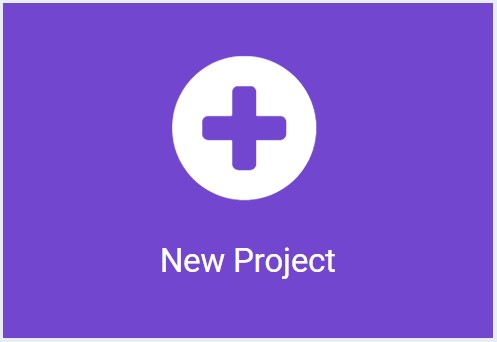

# Hello (Micro:Bit) World! #

## Step 2 - New Project ##

Click the "New Project Button"

    

| Previous | Next |
| -------- | ---- |
| [< Step 1 - Open MakeCode](README.md) | [Step 3 - MakeCode Editor >](3-makecode-editor.md) |