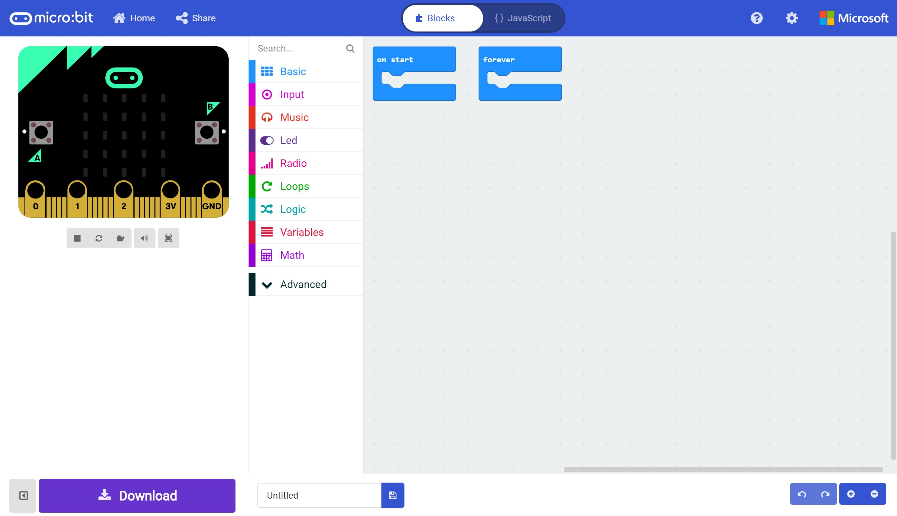

# Hello (Micro:Bit) World! #

## Step 3 - The MakeCode Editor ##

The MakeCode Editor will be shown

    

| Previous | Next |
| -------- | ---- |
| [< Step 2 - New Project](2-new-project.md) | [Step 4 - Serial Toolbox >](4-serial-toolbox.md) |