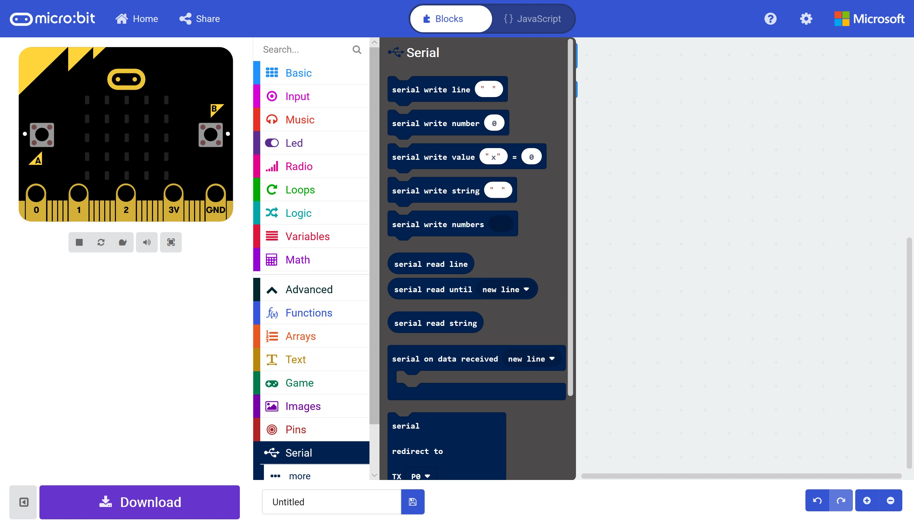
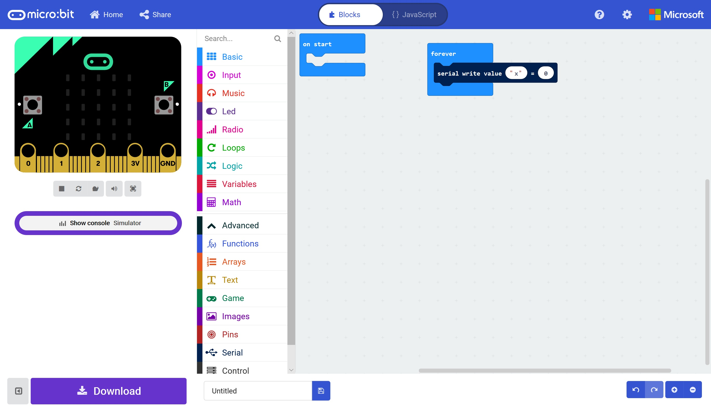
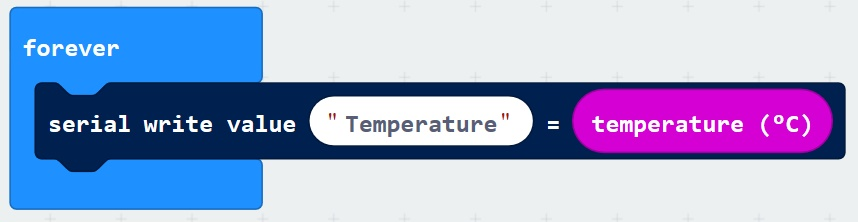
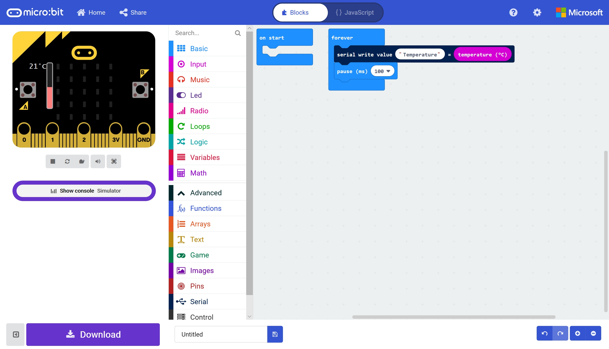
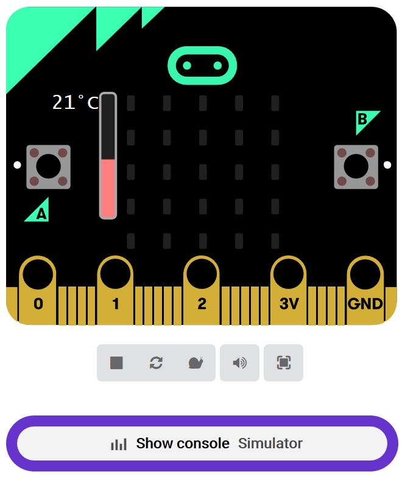
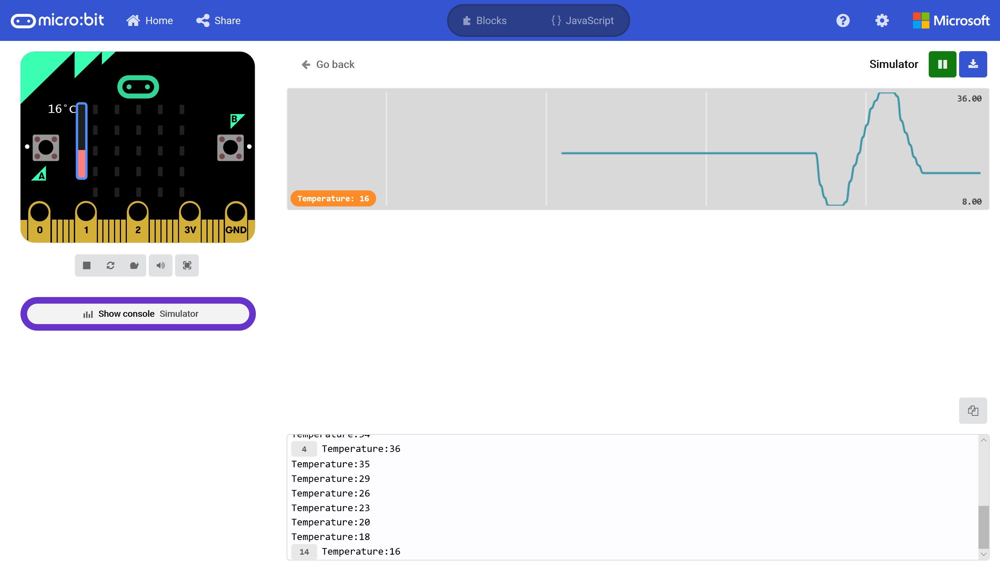

# Hello (Micro:Bit) World! #

## Step 4 - The Serial Toolbox ##

- Click the Advanced Toolbox Section to reveal the Advanced Toolbox Sections.
- Click the Serial Toolbox Section;

    

- Drag a "Serial Write Value (x) = (0)" block onto the "Forever Block";

    

    

- This block will send a Named value to a connected PC using the Virtual Serial Port.

- Change the "x" to "Temperature".
- Click the Input Toolbox Section.
- Drag a Temperature Block on the "0" section of the "Serial Write Value" Block;

    

- Click the Basic Toolbox Section.
- Drag a Pause Block beneath the Serial Write Value Block;

    

- You'll have noticed in the previous step that there's a new area appeared beneath our Micro:Bit - Show Console Simulator;

    

- Clicking this will reveal the Serial Console Simulator;

    

- The top section plots a graph of values, where the bottom section shows the raw Serial Data.
- Move the Temperature Gauge on our simulated Micro:Bit, you'll see the values plotted on the top, and written below will change.
- Go ahead and name your project and download the HEX file.

| Previous | Next |
| -------- | ---- |
| [< Step 3 - MakeCode Editor](3-makecode-editor.md) | [Step 5 - COM Port Setup >](5-com-port-setup.md) |